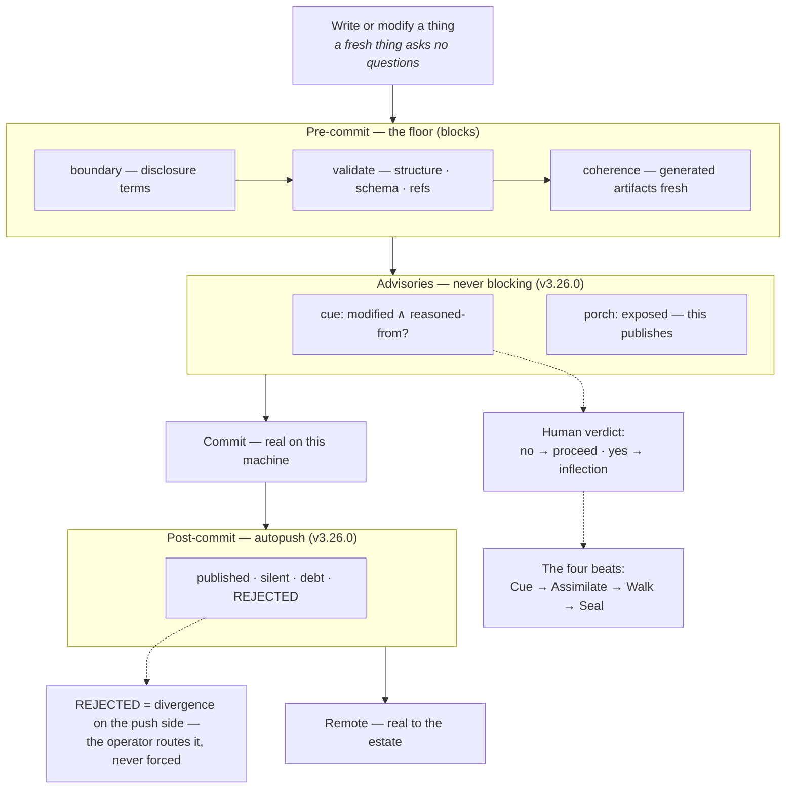
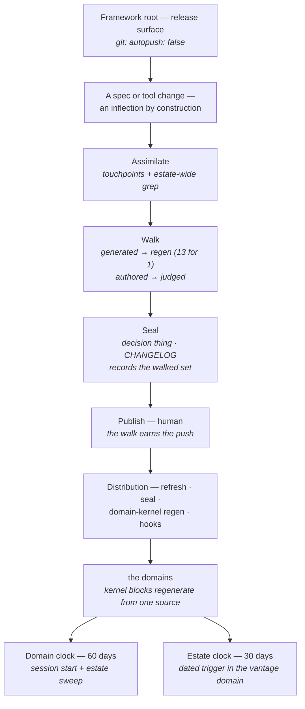
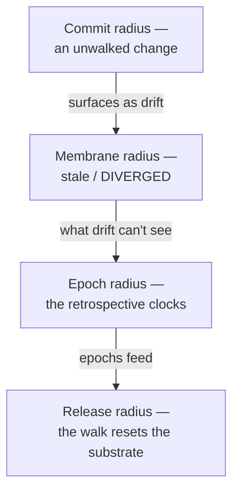

# Estate Mechanics — publication, reconciliation and cadence at three radii

How state flows and stays coherent after v3.26.0, told at the three levels
an operator actually works at: inside one domain, between domains, and at
the substrate. The diagrams carry most of the words. One sentence governs
everything below, at every level: **the floor asks questions, gathers
facts, and transports state; the human answers questions, routes
divergences, and decides.** Nothing anywhere auto-edits, auto-merges, or
auto-judges.

The architect can see these internals from memory. Nobody else can without
reading the specs whole — this page is the shortcut. (Normative sources:
`git-workflow.md`, `change-reconciliation.md`, `retrospective.md`,
`orchestration.md`; decision `autopush-moves-the-deliberate-act`.)

---

## 1 · Inside a single domain — the life of one commit

A *fresh* thing is silent: a new thing on a clean slate can contradict
nothing, so risk enters at *change*, not creation. When a change is
committed, the floor blocks on the three gates it always had, then asks two
questions it never asked before — and after the commit lands, publication
happens by itself.

The mental model: the left rail is mechanical, the right rail is human.
`candidates` makes the cue *question* unavoidable (modified ∧ reasoned-from
— definition-surface types always, ordinary things at fan-in ≥ 3) while the
cue *verdict* stays the driver's. Saying no to a named question is a
decision; not being asked was drift. Autopush is transport of
floor-validated state — bounded, never forcing, `git: autopush: false` to
opt a repo out (absence means on).

---

## 2 · Domain to domain — the membrane

The consumer side always had the machinery (estate-sync, imports-check,
quarantine). v3.26.0 gave the producer side a voice and closed the
transport gap: a producer's face is now current the moment it commits, so
drift detection is real-time-honest.

```mermaid
flowchart LR
    accTitle: The membrane between a producer domain and a consumer domain
    accDescr {
        Left to right, three zones. In the producer domain, an authoring-time
        human call sets exposed to true, which raises a serve advisory saying
        this change publishes, then the commit is floor-validated and autopushed.
        That reaches the middle zone, the remote face. In the consumer domain,
        estate-sync fetches fast-forward-only at session start, imports-check
        compares against pins and reports stale or DIVERGED, imports land in
        quarantine marked origin external and verified false, and only a named
        human flips verified in its own commit. Transport is accelerated but
        trust is not: the producer never learns who pulls.
    }
    subgraph PROD["Producer domain"]
        E["expose: true<br/><i>authoring-time human call</i>"] --> SA["serve advisory<br/><i>'this change publishes'</i>"]
        SA --> PC["commit — floor validates"] --> PA["autopush"]
    end
    F[("the remote<br/>face")]
    subgraph CONS["Consumer domain"]
        S["estate-sync at session start<br/><i>fetch + ff-only</i>"] --> IC["imports-check<br/><i>stale / DIVERGED vs pins</i>"]
        IC --> QU["quarantine<br/><i>origin: external · verified: false</i>"] --> VF["verified flip — human,<br/>named, own commit"]
    end
    PA --> F --> S
```

The invariant that did **not** move: **autopush accelerates transport,
never trust.** Imports still land quarantined; only a named human flips
`verified`, in its own commit. And the producer never learns who pulls —
publication is a commit to the face, not a dispatch.

---

## 3 · The substrate — the framework itself

The framework root inverts the default, and the inversion is the design: a
push there is a *release* — outsider-consumed, judgement-gated, with no
mechanical completeness check — so the root declares `autopush: false` and
its push stays the deliberate act. What a release owes first is a walk,
because a release is an inflection *by construction*: it changes the
definition surfaces every domain reasons from.

The Walk's cost model is the load-bearing idea
(`a-generated-surface-collapses-its-walk`): a truth stated once and
*derived* everywhere reconciles by regeneration — one generator string
reconciled thirteen domain kernels in the v3.26.0 walk — while a truth
*restated by hand* costs a judged walk step per restatement, forever.
Restatement count **is** reconciliation cost; promote a restatement into
derivation when a walk revisits it twice.

### The root pointer's second position

One more substrate↔domain interaction, observed live on 2026-08-17: Claude
Code loads `CLAUDE.md` files from every directory *above* the workspace,
root-down, so a session opened in a nested domain inherits the framework
root's entry pointer alongside its own. The two then behave differently by
documented harness rule: the domain pointer's `@AGENTS.md` resolves inside
the workspace and expands, while the inherited root pointer's resolves
*outside* it and is gated as an external import — delivered as literal
text, its target unloaded. That outcome is the right one (a domain session
must not inherit the framework's own entry file), but until 2026-08-17 it
held only by the gate staying unapproved. The wrapper now routes both of
its positions explicitly, and a drift test holds the wording identical
across the tracked root file and both installers. Domain pointers need no
equivalent — nothing nests beneath a domain.

---

## 4 · The interconnection — one primitive at four radii

There are not three systems to hold in your head. There is one split,
repeated at every radius — and the radii nest as safety nets: what one
misses falls to the net beneath.

| Radius | The floor — asks · gathers · transports | The human — decides · routes |
|---|---|---|
| **Commit** | `candidates` asks the cue · `autopush` transports | cue verdict · route rejected pushes |
| **Membrane** | `estate-sync` freshens · `imports-check` detects drift | exposure call · verified flip |
| **Epoch** | cadence clocks (60d domain / 30d estate) · dated triggers | retrospectives · estate rulings, routed home via porch |
| **Release** | release-walk Assimilate, estate-wide | walk judgement · the deliberate push |

Detection mechanical, judgement human, verdicts never scored — the
boundary every v3.24–v3.26 change preserved, which is the strongest
evidence it is drawn where reality wants it.
