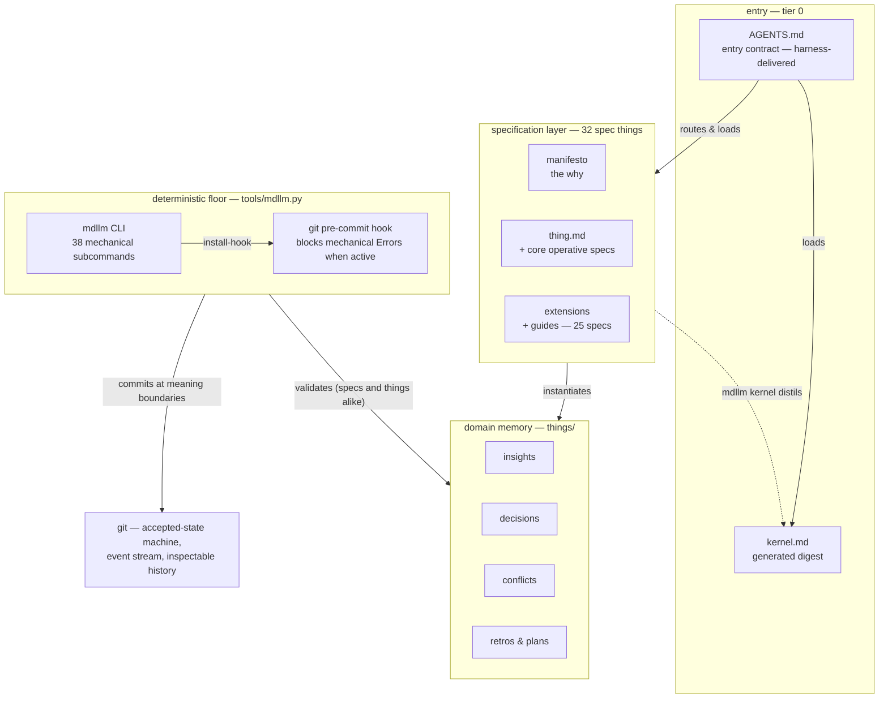
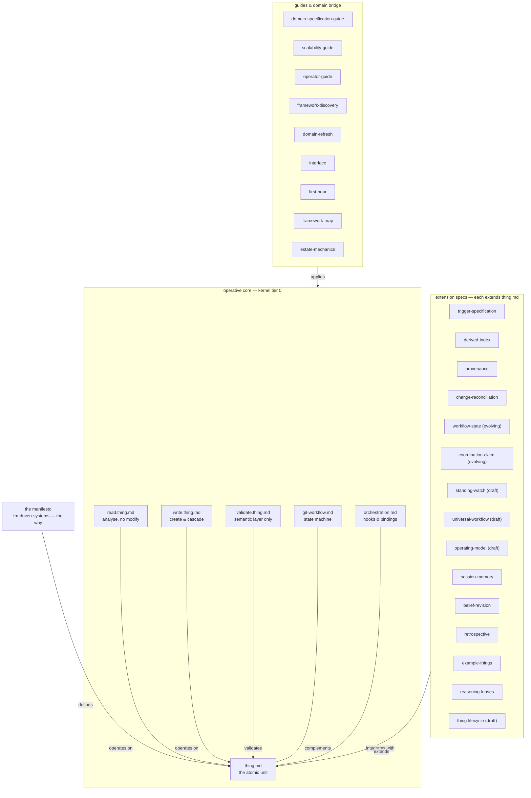
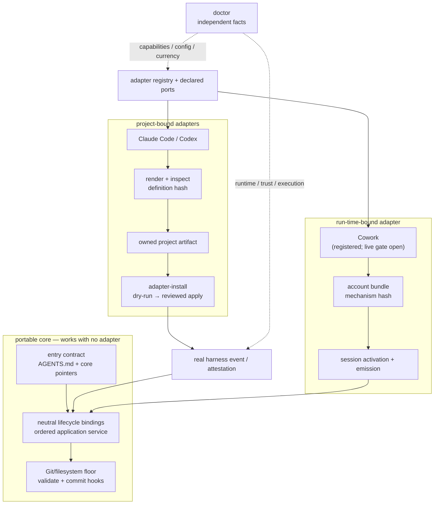

# Framework Map — The Visual Architecture

A scrollable codebase teaches you its shapes; a specification framework hides
them in frontmatter. This map is the substitute for that intimacy: five views,
zooming in, each derived from the repo itself — the spec-to-spec edges from
each file's `linked_things` frontmatter, the subcommand list from
`mdllm --help`, the tier structure from `AGENTS.md`, the estate seam from
`provenance.md`'s Cross-Domain Imports. When you are lost, start here, not in
the prose.

**The compressed mental model: one atom, six operative rules, everything else
is layering.** The manifesto defines [thing.md](../thing.md); five operative specs
say what may be done to the atom; those six are distilled into
[kernel.md](../kernel.md) so a session starts on a small fraction of the
full-spec load (`mdllm tokens` measures it — never assert); fourteen extension
specs each bolt one capability onto the atom; the guides only point inward and
never define anything. The mdllm floor is not a tenth concept — it is the same
paper layer made mechanical, each subcommand mechanising a piece of it (mostly
one per spec; a few carry several — change-reconciliation has four (`coherence`, `touchpoints`, `candidates` — the cue leg that fires on every commit, `cues` — the same question held until a human answers it), git-workflow three (`estate-sync`, `publish`, `autopush`); View 3 is the census and wins — `coherence` for the mechanised slice of the Walk
and `touchpoints` for the Assimilate beat).

## View 1 — Elevation: the five bands

Read top-down, this is a session's life: `AGENTS.md` routes the query and
loads the kernel (itself generated *from* the spec layer — hence the dashed
return edge), the specs define the types that the things in `things/`
instantiate, `mdllm` validates declared mechanical invariants, and git makes a
candidate the accepted recorded state at the commit boundary.

The optional [MarkdownLLM Explorer](../explorer/README.md) is deliberately not
a sixth band. It is a read-only presentation surface over the files and Git
history shown here; it defines no thing, executes no floor rule and has no
authority to accept or publish state. Leaving it outside the operative chain is
the architecture, not an omission from the diagram.

Notes on this view:

- The kernel edge points *up*: `kernel.md` is generated output, regenerated by
  `mdllm kernel` after any spec change. It is the only file in the entry band
  that the floor produces.
- `things/` is the framework's own memory — the framework is a domain within
  itself, so its insights, decisions, conflicts, retrospectives, and plans are
  ordinary things instantiating the reserved types the spec layer defines.
- Domains (`domain/*`) are deliberately absent: they are nested, gitignored,
  independent repos. Each repeats this whole elevation internally with its own
  AGENTS.md, skills, and things.

## View 2 — The spec layer: what defines what

Built from the `linked_things` frontmatter of every root spec. The structure
that falls out: the manifesto defines the atom; read/write/validate operate on
it; git-workflow and orchestration flank it; everything else extends or
applies. The six specs inside the dashed core are exactly the set
`mdllm kernel` distils — which is why the kernel's introduction cut tier 0
to roughly a fifth of its pre-kernel cost (dated figures: CHANGELOG 3.2.0).

Notes on this view:

- **The navigation rule:** when lost, start at `thing.md` and follow one
  `extends` edge outward. Every extension spec carries an
  `extends: thing-specification` relation, usually first (exceptions:
  `provenance` leads with its cluster edge; `reasoning-lenses` carries no
  outbound links — read/write reference it rather than it extending the atom,
  but it lives in the same band).
- The guides column never defines semantics — it only points back inward. You
  can ignore it entirely when reasoning about what the framework *is*;
  it matters when scaffolding, scaling, or refreshing a domain.
- `interface.md` sits in the bridge band because it is the I/O boundary
  (deliverables vs things), defined by the manifesto alongside `thing.md` and
  `git-workflow.md`.
- The map shows the load-bearing edges only. Every declared edge is listed
  below, generated from the same frontmatter — the drawing is curated, the
  list is not.

### Every declared edge, from the frontmatter

Generated by `mdllm docs`; the pre-commit coherence leg refuses drift.
Spec-to-spec edges only — edges to things outside the spec layer are counted,
not named. Each spec's `(type, status)` here is read from its frontmatter, so
a `(draft)` tag in the drawing above can be checked against it.

<!-- generated:spec-edges -->

- **`belief-revision.md`** (`specification`, `stable`): complements → `validate.thing.md`, `session-memory.md`, `orchestration.md`, `derived-index.md`; extends → `thing.md`; implements → `llm-driven-systems.manifesto.md` · +1 edge(s) outside the spec layer
- **`change-reconciliation.md`** (`specification`, `draft`): complements → `belief-revision.md`, `provenance.md`, `derived-index.md`, `validate.thing.md`, `retrospective.md`; extends → `thing.md`; implements → `llm-driven-systems.manifesto.md` · +8 edge(s) outside the spec layer
- **`coordination-claim.md`** (`specification`, `evolving`): complements → `git-workflow.md`, `workflow-state.md`; extends → `thing.md` · +1 edge(s) outside the spec layer
- **`derived-index.md`** (`specification`, `draft`): complements → `orchestration.md`, `trigger-specification.md`, `belief-revision.md`, `scalability-guide.md`, `git-workflow.md`; extends → `thing.md`; implements → `llm-driven-systems.manifesto.md` · +2 edge(s) outside the spec layer
- **`docs/estate-mechanics.md`** (`guide`, `evolving`): documents → `git-workflow.md`, `change-reconciliation.md`, `retrospective.md` · +2 edge(s) outside the spec layer
- **`docs/first-hour.md`** (`guide`, `evolving`): complements → `operator-guide.md`; references → `domain-specification-guide.md`, `framework-map.md`, `framework-discovery.md` · +4 edge(s) outside the spec layer
- **`docs/framework-map.md`** (`guide`, `draft`): complements → `operator-guide.md`; documents → `llm-driven-systems.manifesto.md`, `thing.md`, `validate.thing.md`, `orchestration.md`, `git-workflow.md`, `derived-index.md` · +1 edge(s) outside the spec layer
- **`docs/operator-guide.md`** (`guide`, `draft`): complements → `domain-specification-guide.md`; references → `validate.thing.md`, `provenance.md`, `domain-refresh.md`, `orchestration.md`, `git-workflow.md` · +5 edge(s) outside the spec layer
- **`domain-refresh.md`** (`specification`, `evolving`): extends → `framework-discovery.md`; references → `git-workflow.md`, `domain-specification-guide.md`, `thing.md` · +1 edge(s) outside the spec layer
- **`domain-specification-guide.md`** (`guide`, `stable`): complements → `validate.thing.md`; implements → `llm-driven-systems.manifesto.md`; references → `thing.md`, `read.thing.md`, `write.thing.md`, `validate.thing.md`, `git-workflow.md`, `interface.md`, `session-memory.md`, `belief-revision.md`, `retrospective.md`, `trigger-specification.md`, `reasoning-lenses.md`
- **`example-things.md`** (`specification`, `stable`): complements → `domain-specification-guide.md`; extends → `thing.md`
- **`framework-discovery.md`** (`specification`, `stable`): complements → `domain-refresh.md`; extends → `domain-specification-guide.md`; references → `thing.md`, `git-workflow.md`
- **`git-workflow.md`** (`specification`, `evolving`): complements → `thing.md`, `interface.md`, `write.thing.md`, `validate.thing.md`, `derived-index.md`; implements → `llm-driven-systems.manifesto.md` · +3 edge(s) outside the spec layer
- **`interface.md`** (`specification`, `evolving`): complements → `provenance.md`, `thing.md`, `git-workflow.md`, `read.thing.md`, `write.thing.md`; implements → `llm-driven-systems.manifesto.md` · +3 edge(s) outside the spec layer
- **`llm-driven-systems.manifesto.md`** (`manifesto`, `evolving`): informs → `scalability-guide.md`, `domain-specification-guide.md` · +4 edge(s) outside the spec layer
- **`operating-model.md`** (`specification`, `draft`): complements → `trigger-specification.md`, `provenance.md`, `coordination-claim.md`; extends → `universal-workflow.md`, `workflow-state.md`; references → `interface.md`
- **`orchestration.md`** (`specification`, `evolving`): complements → `write.thing.md`, `git-workflow.md`, `interface.md`, `trigger-specification.md`, `derived-index.md`; extends → `thing.md`; implements → `llm-driven-systems.manifesto.md`, `session-memory.md`, `belief-revision.md`, `domain-refresh.md` · +2 edge(s) outside the spec layer
- **`provenance.md`** (`specification`, `draft`): complements → `git-workflow.md`, `derived-index.md`, `interface.md`, `belief-revision.md`, `change-reconciliation.md`; extends → `thing.md`; implements → `llm-driven-systems.manifesto.md` · +3 edge(s) outside the spec layer
- **`read.thing.md`** (`specification`, `stable`): complements → `write.thing.md`; extends → `thing.md`; references → `reasoning-lenses.md`
- **`reasoning-lenses.md`** (`specification`, `stable`): no edges to other specs
- **`retrospective.md`** (`specification`, `stable`): complements → `session-memory.md`, `belief-revision.md`, `git-workflow.md`, `derived-index.md`, `change-reconciliation.md`; extends → `thing.md`; implements → `llm-driven-systems.manifesto.md`
- **`scalability-guide.md`** (`guide`, `stable`): complements → `thing-lifecycle.md`, `derived-index.md`; extends → `thing.md`; informs → `read.thing.md`, `write.thing.md`; references → `example-things.md`
- **`session-memory.md`** (`specification`, `evolving`): complements → `orchestration.md`, `write.thing.md`, `git-workflow.md`, `belief-revision.md`; extends → `thing.md`; implements → `llm-driven-systems.manifesto.md`
- **`standing-watch.md`** (`specification`, `draft`): complements → `workflow-state.md`, `trigger-specification.md`, `orchestration.md`, `git-workflow.md`, `coordination-claim.md`, `session-memory.md`; extends → `thing.md` · +10 edge(s) outside the spec layer
- **`thing-lifecycle.md`** (`specification`, `draft`): complements → `scalability-guide.md`, `git-workflow.md`; extends → `thing.md`; implements → `llm-driven-systems.manifesto.md`; informs → `read.thing.md`, `write.thing.md`
- **`thing.md`** (`specification`, `evolving`): complements → `read.thing.md`, `write.thing.md`, `git-workflow.md`, `interface.md`; implements → `llm-driven-systems.manifesto.md`
- **`trigger-specification.md`** (`specification`, `stable`): complements → `orchestration.md`, `derived-index.md`; extends → `thing.md`; references → `provenance.md` · +1 edge(s) outside the spec layer
- **`universal-workflow.md`** (`specification`, `draft`): implements → `workflow-state.md` · +2 edge(s) outside the spec layer
- **`validate.thing.md`** (`specification`, `stable`): complements → `belief-revision.md`, `domain-specification-guide.md`; validates → `thing.md`, `orchestration.md`, `derived-index.md`, `provenance.md` · +1 edge(s) outside the spec layer
- **`workflow-state.md`** (`specification`, `evolving`): complements → `coordination-claim.md`, `interface.md`, `git-workflow.md`, `provenance.md`, `orchestration.md`; extends → `thing.md` · +1 edge(s) outside the spec layer
- **`write.thing.md`** (`specification`, `stable`): complements → `read.thing.md`, `git-workflow.md`; extends → `thing.md`; references → `validate.thing.md`, `reasoning-lenses.md`

<!-- /generated:spec-edges -->

## View 3 — The deterministic floor: subcommand → spec

Each `mdllm` subcommand exists to mechanise exactly one piece of the paper
layer, so the tool is best understood as a mapping, not a monolith. Solid
edges enforce or measure a spec; dashed edges generate an artifact.

```mermaid
flowchart LR
    accTitle: View 3 - each mdllm subcommand mapped to the one spec it mechanises
    accDescr {
        A left column of 38 mdllm subcommands, each with a single edge to the
        spec surface it serves in the right column. The tool is a mapping, not
        a monolith. Solid edges enforce or measure a spec, and dashed edges
        generate an artifact. Enforcing or measuring: validate, triggers,
        index, provenance, eval, tokens, doctor, scaffold, refresh, coherence,
        touchpoints, cascade, imports-check, external-trust, boundary,
        estate-check, estate-sync, calc, candidates, cues (the cue question
        read back off the commit stream and held until a human answers it),
        precommit (the hook's legs composed concurrently against one frozen
        candidate), and the harness-event dispatcher.
        Generating: kernel, changelog, install-hook, worklog, domain-kernel,
        session-start, mcp-serve, bundle, autopush, adapter-install, docs and
        dispatch-payload, which composes a scheduler tick's launch text from
        the standing dispatch prompt and writes nothing. The
        new assembly and guarded-publication commands mechanise explicit
        bootstrap and outbound publication. The division of
        labour is the point - the floor owns mechanical validation, structural,
        referential and schema, while the agent owns semantic validation only.
        Never re-perform a mechanical check by reasoning.
    }
    subgraph cli ["mdllm subcommand"]
        C1["validate"]
        C2["triggers"]
        C3["index"]
        C4["provenance"]
        C5["eval"]
        C6["tokens"]
        C7["kernel"]
        C8["changelog"]
        C9["install-hook"]
        C10["doctor"]
        C11["scaffold"]
        C12["worklog"]
        C13["refresh"]
        C14["coherence"]
        C15["touchpoints"]
        C16["domain-kernel"]
        C17["session-start"]
        C18["cascade"]
        C19["mcp-serve"]
        C20["imports-check"]
        C21["boundary"]
        C22["estate-check"]
        C23["estate-sync"]
        C24["calc"]
        C25["candidates"]
        C26["autopush"]
        C27["runtime-probe"]
        C28["adapter-install"]
        C29["harness-event<br/>(internal)"]
        C30["assemble"]
        C31["bundle"]
        C32["publish"]
        C33["external-trust"]
        C34["precommit"]
        C35["dispatch-payload"]
        C36["cues"]
        C37["watch"]
        C38["docs"]
    end
    subgraph target ["what it serves"]
        T1["validate.thing.md"]
        T2["trigger-specification.md"]
        T3["derived-index.md"]
        T4["provenance.md"]
        T5["evals/ golden fixtures"]
        T6["AGENTS.md tier table"]
        T7["kernel.md"]
        T8["CHANGELOG.md"]
        T9["git pre-commit hook"]
        T10["floor availability itself"]
        T11["pre-domain-scaffold:isolate<br/>hard hook"]
        T12["git log (on-demand view)"]
        T13["domain-refresh.md"]
        T14["change-reconciliation.md<br/>dark-region walk (catalog slice)"]
        T15["change-reconciliation.md<br/>Assimilate beat"]
        T16["AGENTS.md<br/>domain entry kernel"]
        T17["orchestration.md<br/>session-start:version-check"]
        T18["write.thing.md<br/>post-completion cascade"]
        T19["mcp-domain-server.md<br/>exposed face — producing side"]
        T20["mcp-domain-server.md<br/>quarantined imports — consuming side"]
        T21["local .boundary-terms<br/>disclosure boundary (never committed)"]
        T22["mcp-domain-server.md<br/>estate batching — operator axis"]
        T23["git-workflow.md<br/>The Machine Axis — sync before orienting"]
        T24["thing.md<br/>declared derivations — the floor does every sum"]
        T25["change-reconciliation.md<br/>the cue question at the commit boundary"]
        T26["git-workflow.md<br/>The Outbound Rules — publication leg"]
        T27["floor availability itself — per-candidate runtime facts"]
        T28["orchestration.md<br/>project-local harness adapter boundary"]
        T29["orchestration.md<br/>ordered lifecycle bindings"]
        T30["orchestration.md<br/>explicit bootstrap lifecycle"]
        T31["interface.md<br/>rendered distribution deliverable"]
        T32["git-workflow.md<br/>guarded outbound publication"]
        T33["clone-local MCP authority<br/>exact entry hash in Git directory"]
        T34["templates/prompts/dispatch-loop.md<br/>the standing dispatch prompt"]
        T35["change-reconciliation.md<br/>The Cue Persists — the question held until answered"]
        T36["standing-watch.md<br/>the doorbell in the floor — reads workflow-state's actor table"]
        T37["docs/ derived blocks<br/>the operator-guide toolbox, this map's edge list"]
    end

    C1 -->|"enforces (levels 1–3)"| T1
    C2 -->|evaluates| T2
    C3 -->|"checks / rebuilds"| T3
    C4 -->|enforces| T4
    C5 -->|checks against| T5
    C6 -->|measures| T6
    C7 -.->|generates| T7
    C8 -.->|drafts| T8
    C9 -.->|installs| T9
    C10 -->|"execution-tests"| T10
    C11 -->|mechanises| T11
    C12 -.->|generates| T12
    C13 -->|"reports drift for"| T13
    C14 -->|"mechanises catalog slice of"| T14
    C15 -->|"assimilates for"| T15
    C16 -.->|"generates"| T16
    C17 -.->|"emits ritual for"| T17
    C18 -->|"gathers downstream for"| T18
    C19 -.->|"serves over MCP (stdio or --http)"| T19
    C20 -->|"re-checks quarantine for"| T20
    C21 -->|"blocks crossings of"| T21
    C22 -->|"batches imports-check for"| T22
    C23 -->|"fetch + ff-only pull for"| T23
    C24 -->|"computes and re-checks"| T24
    C25 -->|"asks the cue for"| T25
    C26 -.->|"publishes validated commits per"| T26
    C27 -->|"probes interpreter/dependency/command for"| T27
    C28 -.->|"preflights and applies the selected"| T28
    C29 -->|"dispatches one adapter event through"| T29
    C30 -->|"assembles and emits"| T30
    C31 -.->|"renders"| T31
    C32 -->|"guards"| T32
    C33 -->|"authorises exact local definition for"| T33
    C34 -->|"composes the hook's legs concurrently for"| T9
    C35 -.->|"composes the launch text from"| T34
    C36 -->|"holds the unanswered cue for"| T35
    C37 -->|"rings the doorbell on the remote ref for"| T36
    C38 -.->|"regenerates and drift-gates"| T37
```

Notes on this view:

- The division of labour is the point: the floor owns mechanical validation
  (structural, referential, schema); the agent owns semantic validation only
  (`validate.thing.md` → Layer 2). Never re-perform a mechanical check by
  reasoning.
- `install-hook` is the floor enforcing its enumerated checks: when the hook is
  installed and runnable, it wires `validate` into the commit boundary so
  mechanical Errors are caught even when an agent forgets to run it by hand.
- `doctor` is the floor checking it can exist here at all: prerequisites,
  hook *execution* (resolution is not verification), and framework-version
  drift for domains. With `--harness`, support, configuration, currency,
  trust, runtime, and real-event execution remain independent facts. Exit 1
  means degraded mode — validate manually and say so.
- `adapter-install` is the explicit project mutation boundary: it shows the
  selected adapter's owned diff, safely merges only that surface, and refuses
  ambiguity. Its optional `--refresh-legacy` path accepts only an exact
  adapter-declared legacy ID and replaces only the policy-owned byte span;
  ordinary install never silently migrates history. `harness-event` is its
  internal execution counterpart; a real
  lifecycle hook calls it to run ordered bindings and record hash-bound
  execution evidence. Neither makes an adapter part of the portable core.

## View 4 — Optional harness adapters around the portable core

The adapter registry hardens selected lifecycle moments without becoming the
substrate. Two binding shapes now exercise the same declared ports. A
project-bound adapter renders an owned project artifact before the session; a
run-time-bound adapter renders no project artifact and binds later through a
bundle/bootstrap surface. Doctor reports those different facts without
inventing a vendor branch or collapsing support, configuration, currency,
trust, runtime, and execution into one green light.

Notes on this view:

- Entry discovery is left of the adapter boundary. `CLAUDE.md` is a core entry
  pointer written even by `--harness none`; neither adapter removal nor a
  run-time-bound adapter may make the domain's interpretation contract vanish.
- `adapter-install` is meaningful only when a renderer owns project bytes. An
  empty render is the port-derived signal for not-applicable project
  configuration, not a special Cowork conditional in shared control flow.
- Registration proves the adapter satisfies the build-time contracts. A public
  compatibility row requires its own live, graded evidence. Claude Code and
  Codex have named records; Cowork's remote/local records remain owned by its
  plan.

## View 5 — Two domains: the estate seam

Views 1–4 are one domain deep. This is the only view with two: how a producer's
curated face reaches a consumer's quarantined import, and how the consumer
keeps that hand-off honest as both sides move. Every arrow that crosses the
seam passes through the porch — including "have you changed?".

```mermaid
flowchart LR
    accTitle: View 5 - the estate seam between a producer domain and a consumer domain
    accDescr {
        Two domains side by side, and every arrow crossing between them passes
        through the porch - including the question have you changed. In domain
        A, the producer, things opted in with exposed true feed the porch, a
        curated read-only face served by mdllm mcp-serve. In domain B, the
        consumer, an address book in .mcp.json proposes a producer route. A
        clone-local trust record in the Git directory must authorize the exact
        entry hash before anything spawns or contacts the porch. The porch
        hands over a deliverable
        plus the reference triple, which becomes an import marked origin
        external, pinning source domain, id and commit. That import is checked
        by mdllm imports-check, which reports fresh, stale, diverged or
        unreachable, and which polls the porch for freshness and content. A
        stale or diverged result re-quarantines the import and routes it into
        change-reconciliation as an external inflection.
    }
    subgraph A["domain A (producer)"]
        EX["exposed things<br/>(exposed: true opt-in)"]
        PORCH["porch — mdllm mcp-serve<br/>(curated read-only face)"]
        EX --> PORCH
    end
    subgraph B["domain B (consumer)"]
        AB["address book (.mcp.json)<br/>repository proposal — inert by default"]
        TRUST["external-trust<br/>clone-local exact-hash authority"]
        IMP["import — origin: external<br/>pins source_domain/id/commit"]
        IC["mdllm imports-check<br/>fresh / stale / diverged / unreachable"]
        CR["change-reconciliation<br/>receives external inflection"]
        AB -->|"review exact entry"| TRUST
        TRUST -. "only when authorised: spawn/contact" .-> PORCH
        PORCH -- "deliverable + triple" --> IMP
        IMP --> IC
        IC -. "freshness + content poll" .-> PORCH
        IC -- "stale or diverged → re-quarantine" --> CR
    end
```

Notes on this view:

- Both sync directions are consumer-side reads: `stale` = the source moved
  under the pin; `diverged` = the pin is current but the mirror's content no
  longer matches the face (the loop was bypassed). The producer never learns
  who consumes it.
- `.mcp.json` is committed data, never authority by itself. `external-trust`
  stores the operator's exact-hash grant below the clone's Git directory; the
  record is not committed, and a changed entry returns to default-deny.
- `estate-check` is this view repeated per named consumer root and rolled up —
  batching, never an index; nothing is discovered, persisted, or
  reverse-mapped.
- The full doctrine lives in `provenance.md` (Cross-Domain Imports),
  `change-reconciliation.md` (External Inflections), and the design record
  `docs/plans/mcp-domain-server.md`.

## Keeping This Map Honest

This map is hand-drawn, and
[tracking artifacts can drift from reality](../things/insights/tracking-artifacts-can-drift-from-reality.md).
Its sources of truth are mechanical — check against them, do not trust the map
over them:

- **View 1:** the root file listing and `AGENTS.md` tier structure. The
  spec-thing count is a mechanical fact — every `.md` under root and `docs/`
  whose frontmatter `type` is specification/guide/manifesto (29 at last count:
  22 + 6 + 1, including `docs/plans/mcp-domain-server.md` and the
  formerly frontmatter-less `docs/estate-mechanics.md`) — recount before
  restating; a review-loop finding caught this label two behind reality.
- **View 2:** each spec's `linked_things` frontmatter; the kernel coverage
  count in `kernel.md` frontmatter (`coverage: 6`). **Gated since `mdllm
  docs` landed:** every spec on disk must have a node here, a node's
  `(status)` tag must match its frontmatter, and the edge list under the
  view is generated, not drawn.
- **View 3:** `mdllm --help` through the repository's manual launch route.
  **Gated:** every subcommand must have a node in the `cli` subgraph and
  every node there must be a subcommand — `mdllm docs --check`, run by the
  pre-commit coherence leg. The spec each one serves stays drawn by hand.
- **View 4:** `tools/markdownllm/adapters/__init__.py`,
  `harness_ports.py`, `harness_diagnostics.py`, and the adapter capability /
  render / probe contracts. The plan evidence, not this diagram, decides which
  named product claims are verified.
- **View 5:** `provenance.md` → Cross-Domain Imports (the states and the
  membrane rule) and `mdllm imports-check --help` / `estate-check --help`.

When a spec is added, removed, or rewired — or a subcommand lands — update the
affected view in the same commit. If the map and the frontmatter disagree, the
frontmatter wins and the map has a bug.
