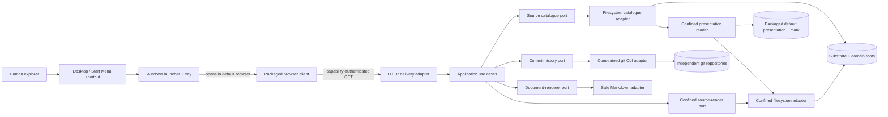
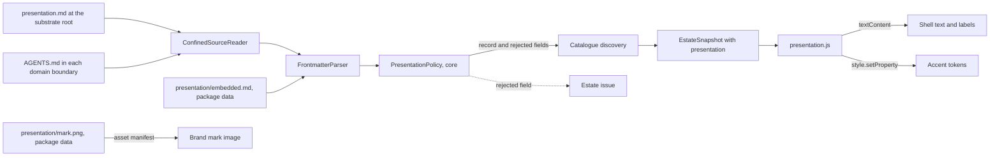
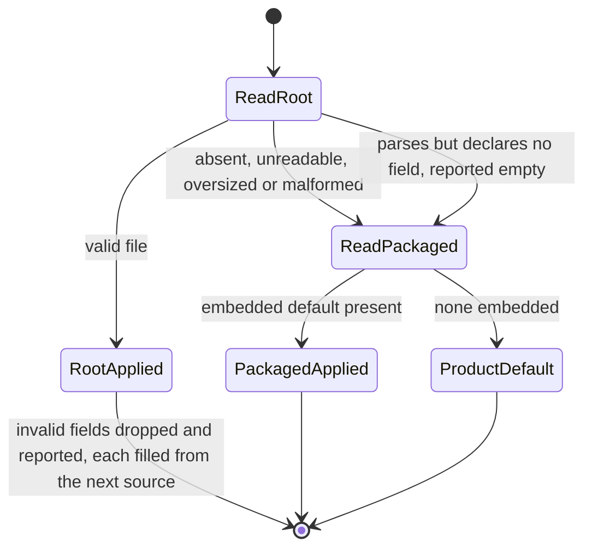

# MarkdownLLM Explorer — Design Specification

**Status:** 0.4.1 maintenance correction: persistent service and repaired macOS file reading/stop. The white-label increment remains deferred under the Desktop product decision; actual Mac acceptance and public Windows signing remain open.

**Version:** 0.7

**Date:** 2026-09-05

**Requirements:** `explorer/docs/requirements.md` v0.7

**Architectural sources:** MarkdownLLM framework v3.36.0; Code Architect domain `c711d2a46225aaca471100e1eec2afceb02e751a`

## 1. Position

MarkdownLLM Explorer is a read-only local projection of an existing substrate and its nested domain repositories. It does not import domain state into a database, reinterpret git as application state, or put business rules into the browser. The product core remains one installable Python package containing:

- a pure domain/application core that models sources, ownership, documents, collections and commits;
- replaceable filesystem, git and Markdown adapters;
- a loopback HTTP delivery adapter; and
- a build-free browser client made from packaged HTML, CSS and native JavaScript modules.

On Windows that package is frozen into a self-contained application directory and wrapped in one native setup executable. End users see a Desktop application, not a Python environment. The substrate remains Markdown + YAML + directories + git. Explorer is a replaceable outside adapter.

## 2. Architectural decisions

### D-001 — Python, not Go

Python 3.10+ is the v1 delivery language. It aligns with the deterministic floor, makes path/git fixtures reusable, and satisfies the measured local workload without adding a second toolchain. Go would become justified only if the packaged Python runtime fails the distribution or performance contract; no current evidence says it will.

### D-002 — Standard-library HTTP at the edge

The delivery adapter uses `http.server.ThreadingHTTPServer` with a bounded-request mixin and explicit routing. FastAPI/Flask would improve routing convenience but introduce a framework and server dependency for seven GET APIs. HTTP stays outside the application boundary, so a later framework swap changes only delivery/composition and its tests.

### D-003 — Exactly pinned PyYAML is the only runtime package dependency

Frontmatter must support the YAML shapes real things use. The package therefore pins `PyYAML==6.0.3`, already exercised by the floor. YAML is parsed and normalised through constrained stages with byte, depth, scalar, collection and result-size limits. Markdown parsing and HTML presentation are separate Explorer-owned adapters: raw HTML is always escaped, and only required Markdown constructs are emitted. This avoids a CDN and avoids making active HTML somebody else's default.

### D-004 — Native browser modules, no build chain

Packaged ES modules provide state, routing, API access and focused view components. There is no Node runtime, bundler or runtime fetch of third-party assets. The browser client may be replaced without changing application use cases.

### D-005 — Capability-bearing loopback session

Loopback is necessary but insufficient. Each process generates a 256-bit capability and prints `http://127.0.0.1:<port>/#cap=<value>`. URL fragments never reach the HTTP request line or access logs. Bootstrap stores the value in `sessionStorage`, removes it from the visible URL with `history.replaceState`, and sends it only in `X-Explorer-Capability`. APIs also validate exact Host and Origin and compare the bounded header with `hmac.compare_digest`. Capability and cursor-HMAC keys are independent, in memory only and die with the process/browser session.

### D-006 — Shipped together, installed independently

`explorer/` lives in the public substrate repository and owns its own `pyproject.toml`, package assets, tests, console entry point and native packaging definitions. It neither imports `tools/mdllm.py` nor assumes a checkout-relative cwd. `pip install <checkout>/explorer` remains the developer/automation route; the Windows installer is the human route. Both target any conforming root selected at launch/install time.

### D-007 — One-folder frozen runtime inside one NSIS setup executable

PyInstaller freezes the Windows application as a one-folder bundle; NSIS packages that folder into the single setup `.exe` the user receives. A raw one-file PyInstaller executable was rejected because it must expand itself to a temporary directory on every launch, slows desktop startup and still provides no root selection, shortcuts, upgrade identity or uninstaller. NSIS is build-time infrastructure only. The installed runtime contains Python, PyYAML, browser assets and the Windows desktop adapter and requires no system interpreter.

The public build supplies a SignTool path, a certificate-store thumbprint and an HTTPS RFC 3161 timestamp URL as one fail-closed set. The build signs the frozen application before packaging; NSIS `!uninstfinalize` signs the generated uninstaller and `!finalize` signs the setup. SHA-256 is used for file and timestamp digests. An unsigned build remains a local development artefact, not a releasable Windows binary.

### D-008 — The desktop launcher is an outer driver

The existing CLI remains a console driver. `windows_app.py` is a separate Frameworks/Drivers entry point: it validates launch arguments, composes the existing runtime, owns browser and notification-area adapters, and coordinates shutdown. It adds no estate/domain policy and does not change application ports. PyInstaller/NSIS files live under `packaging/windows/` and never enter core/application packages.

### D-009 — Single-instance command channel, capability never persisted

The Windows launcher owns a per-user named mutex and named pipe. The first process keeps the capability-bearing URL only in memory and listens for the command `open`. A second shortcut activation sends only that command and exits; the existing process opens its own URL. The URL/capability is never written to registry, shortcut, disk or pipe. The only retained launch setting is the selected substrate root, stored by the installer under the current user's application key and repeated in shortcut arguments.

### D-010 — Presentation is data at the install radius

An organisation's brand is a property of its checkout, not of any domain and not of an Explorer control. It is one install-local file, `presentation.md` at the substrate root, in the same family as the ignored `domain/` directory and the floor's `.boundary-terms`: read by the product, never tracked by the framework. Explorer reads it through the confined reader like any other file and validates every field in a pure core policy; a domain's own identity is read the same way from the `name` and `description` its entry file already declares. A plugin-style extension point was rejected because anything loaded from the estate would execute or render inside a product whose safety case is that estate bytes cannot; a domain-owned claim with an exactly-one rule was withdrawn because for an adopter every domain is the organisation's and the rule served nobody.

### D-011 — Images are package data, and the manifest is the only image route

The content security policy moves from `img-src 'none'` to `img-src 'self'`, and nothing else. The only same-origin URLs that answer with an image content type are entries of the immutable packaged asset manifest: the product icon and, when a build profile placed one, a single packaged mark. No API route serves bytes with an image type, the document presenter emits no image element, and the root presentation file has no field that can name, enable or replace an image. "Repository bytes never render as an image" therefore stays literally true; the boundary moved one step outward and did not open.

### D-012 — A build profile parameterises the outer packaging only

One profile names the product, publisher, installer output, icon, mark image and embedded default presentation. A build applies it by writing package data and passing NSIS defines; it changes no core or application module and no source policy, and the default profile reproduces today's build inputs byte for byte. The frozen executable filename and the per-user mutex and pipe identities stay the product's in this increment, so for one Windows user only one frozen Explorer runs at a time whatever its brand or root, and a second brand's activation opens the running instance's browser; two brands may be installed side by side, each under its own directory, registry key and shortcuts, and neither upgrades nor uninstalls the other. Renaming the executable is deferred to the Windows publication lane, which owns the lifecycle evidence that change would need.

## 3. System context



Presentation enters through the catalogue: the same discovery that admits sources reads each source's declared identity and the substrate's root presentation file through the confined reader, applies the pure presentation policy, and publishes identity and presentation inside the one atomic estate snapshot. The packaged default and mark are package data read once at composition.

### Model views for the presentation increment





The state view is per field: the identity group (name, tagline, text mark) takes the first source with a valid name; each accent and each label walks the chain on its own; the mark image never leaves the packaged source.

All dependency arrows in source code point from outer adapters toward application-owned ports and pure models. Core/application modules import no HTTP, browser, subprocess, filesystem or YAML/HTML implementation.

## 4. Package and module layout

```text
explorer/
├── pyproject.toml
├── README.md
├── packaging/windows/
│   ├── build.ps1
│   ├── explorer.nsi
│   ├── launcher.py
│   ├── version-info.txt
│   └── assets/markdownllm-explorer.ico
├── packaging/apply_profile.py
├── packaging/profiles/
│   ├── default.yaml
│   ├── reverb.yaml
│   └── reverb/ (presentation.md, reverb-256.png, reverb.ico)
├── docs/
│   ├── requirements.md
│   ├── design.md
│   └── test-specification.md
├── src/markdownllm_explorer/
│   ├── __init__.py
│   ├── __main__.py
│   ├── windows_app.py
│   ├── composition.py
│   ├── core/
│   │   ├── models.py
│   │   ├── errors.py
│   │   ├── limits.py
│   │   ├── eligibility.py
│   │   └── presentation.py
│   ├── presentation/            ← package data written only by a build profile
│   │   ├── embedded.md          ← optional embedded default presentation
│   │   ├── mark.png             ← optional packaged mark image
│   │   └── product.json         ← optional product name and publisher for native surfaces
│   ├── application/
│   │   ├── ports.py
│   │   ├── discover_estate.py
│   │   ├── get_overview.py
│   │   ├── browse_tree.py
│   │   ├── search_paths.py
│   │   ├── list_collection.py
│   │   ├── get_settings.py
│   │   └── read_document.py
│   ├── adapters/
│   │   ├── collection_reader.py
│   │   ├── confined_link_resolver.py
│   │   ├── filesystem_catalogue.py
│   │   ├── confined_source_reader.py
│   │   ├── presentation_reader.py
│   │   ├── cursors.py
│   │   ├── git_commit_history.py
│   │   ├── process_runner.py
│   │   ├── frontmatter_parser.py
│   │   ├── safe_markdown_parser.py
│   │   └── document_presenter.py
│   └── delivery/
│       ├── http_server.py
│       ├── api_routes.py
│       ├── response_encoding.py
│       └── static/
│           ├── index.html
│           ├── app.css
│           ├── context.css
│           └── js/
│               ├── app.js
│               ├── api.js
│               ├── state.js
│               ├── routing.js
│               ├── theme.js
│               ├── presentation.js
│               ├── overlays.js
│               └── views/
│                   ├── navigation.js
│                   ├── overview.js
│                   ├── tree.js
│                   ├── collection.js
│                   ├── document.js
│                   ├── settings.js
│                   └── context.js
└── tests/
    ├── test_core.py
    ├── test_application.py
    ├── test_adapters.py
    ├── test_http.py
    ├── test_architecture.py
    ├── test_browser_state.py
    ├── test_presentation.py
    ├── test_windows_app.py
    ├── traceability.yaml
    └── evidence/
```

No module is named `manager`, `helper`, `utils` or generic `service`. Each application module implements one use case. `http_server.py` owns protocol/runtime concerns; `api_routes.py` owns route-to-use-case translation; neither contains source policy.

## 5. Core model

All core values are immutable dataclasses or enums.

| Model | Purpose | Key fields |
|---|---|---|
| `SourceId` | Validated opaque UI/API identity | `value` |
| `RelativePath` | Normalised source-relative POSIX path | `parts`, `display` |
| `BoundaryToken` | Opaque reference resolved only by outer adapters | `value` |
| `Source` | Source identity and public facts, with no native path | `id`, `kind`, `display_name`, `description?`, `identity`, `identity_reason?`, `boundary_token`, `markers`, `git_kind` |
| `EstateSnapshot` | One atomic ownership/catalogue observation | `sources`, `issues`, `revision`, `observed_at`, `presentation` |
| `DeclaredIdentity` | What a domain's entry file says about itself, after the policy | `name?`, `description?`, `reason?` (`entry_missing` · `frontmatter_invalid` · `frontmatter_too_large` · `name_invalid`) |
| `PresentationRecord` | One source's contribution before resolution | `source`, `name?`, `tagline?`, `mark?`, `mark_asset?`, `accent?`, `accent_dark?`, `labels` (partial), `rejected`, `empty` |
| `Presentation` | The shell identity resolved for this process | `name`, `tagline?`, `mark`, `mark_asset?`, `accent`, `accent_soft`, `accent_dark`, `accent_soft_dark`, `labels`, `sources` (field → source), `rejected` |
| `PresentationLabels` | The shell vocabulary, every key defaulted | `substrate`, `domains`, `substrate_kind`, `domain_kind`, `skills`, `memory` |
| `PresentationSource` | Where a field came from | `root_file` · `packaged_default` · `product_default` |
| `RejectedField` | One presentation field the policy refused | `source`, `field`, `reason`, `ratio?`, `surface?` |
| `SourceIssue` | Non-fatal source discovery fact | `code`, `source_id?`, `message` |
| `SourceSettingsRecord` | Authenticated outer source facts | `source_id`, `source_path`, `markers`, `kind`, `git_kind` |
| `TreeNode` | One eligible directory/file row | `path`, `name`, `kind`, `size?`, `modified_at?`, `expandable` |
| `Page[T]` | Bounded deterministic page | `items`, `next_cursor`, `partial`, `observed_at` |
| `RepositoryState` | Git availability/state | `kind`, `head_sha?`, `branch?`, `dirty?`, `issue?` |
| `CommitRecord` | Read-only commit evidence | `sha`, `subject`, `author_name`, `authored_at` |
| `FrontmatterResult` | Parsed JSON-safe or explicitly invalid metadata | `state`, `values`, `error_code?` |
| `LinkCandidate` | Parsed, inactive document link | `label`, `raw_target`, `kind` |
| `DocumentRecord` | One requested document representation | `source_id`, `path`, `mode`, `content`, `frontmatter`, `links`, `size`, `modified_at`, `issues` |
| `CollectionItem` | Skill/memory route to a document | `path`, `title`, `group`, `thing_id?`, `thing_type?`, `issues` |

An adapter-owned `BoundaryRegistry` maps `BoundaryToken` to canonical roots, excluded/candidate roots and native git stores. Native paths never enter core/public DTOs; authenticated Settings obtains an explicitly redacted path field from a dedicated outer query.

## 6. Application-owned ports

```python
class SourceCatalogue(Protocol):
    def snapshot(self) -> EstateSnapshot: ...
    def source(self, source_id: SourceId) -> Source: ...

class SourceMetrics(Protocol):
    def overview_counts(self, source: Source) -> SourceCounts: ...

class DirectoryBrowser(Protocol):
    def list_directory(self, source: Source, path: RelativePath,
                       cursor: str | None) -> Page[TreeNode]: ...

class PathSearch(Protocol):
    def search(self, source: Source, query: str,
               cursor: str | None) -> Page[TreeNode]: ...

class CollectionReader(Protocol):
    def collection(self, source: Source, kind: CollectionKind,
                   cursor: str | None) -> Page[CollectionItem]: ...

class SourceSettings(Protocol):
    def settings(self, source: Source) -> SourceSettingsRecord: ...

class DocumentReader(Protocol):
    def read(self, source: Source, path: RelativePath) -> RawDocument: ...

class LinkResolver(Protocol):
    def resolve(self, source: Source, document: RelativePath,
                candidate: LinkCandidate) -> ResolvedLink: ...

class CommitHistory(Protocol):
    def repository_state(self, source: Source) -> RepositoryState: ...
    def commits(self, source: Source, cursor: str | None) -> Page[CommitRecord]: ...

class FrontmatterParser(Protocol):
    def parse(self, raw: RawDocument) -> ParsedDocument: ...

class MarkdownParser(Protocol):
    def parse(self, body: str) -> MarkdownTree: ...

class DocumentPresenter(Protocol):
    def present(self, tree: MarkdownTree,
                links: tuple[ResolvedLink, ...]) -> str: ...

class IdentityReader(Protocol):
    def declared_identity(self, boundary: SourceBoundary) -> DeclaredIdentity: ...

class PresentationReader(Protocol):
    def root_presentation(self, boundary: SourceBoundary
                          ) -> tuple[PresentationRecord | None, tuple[SourceIssue, ...]]: ...
```

`IdentityReader` and `PresentationReader` are adapter-to-adapter seams consumed by the catalogue during discovery, not by use cases: the catalogue is the one component that holds native boundaries, and the readers answer questions about a boundary through the confined reader without touching the public registry. Use cases still see only the atomic snapshot.

The protocols contain domain nouns and bounded operations only. They do not expose arbitrary command arguments, filesystem handles, HTML templates or HTTP types.

## 7. Use cases

| Use case | One reason to change | Ports used |
|---|---|---|
| `DiscoverEstate` | Estate response semantics, including the resolved presentation carried by the snapshot | `SourceCatalogue` |
| `GetOverview` | Source summary composition | catalogue, metrics, history |
| `BrowseTree` | Directory-page semantics | catalogue, directory browser |
| `SearchPaths` | Query validation and result semantics | catalogue, path search |
| `ListCollection` | Skills/memory grouping contract | catalogue, collection reader |
| `GetSettings` | Authenticated read-only source-path facts | catalogue, source settings |
| `ReadDocument` | Mode-specific read/parse/link/present orchestration | catalogue, document reader, frontmatter parser, Markdown parser, link resolver, presenter |
| `GetCommit` | Which paths a commit touched, and which of them this source may open | catalogue, commit details, path admission |
| `ReadHistoricalDocument` | Admission before history, then a commit's own bytes | catalogue, commit details, path admission |
| `ResolveReferences` | Turning declared identifiers into openable paths | catalogue, reference index |

Use cases validate IDs/query shapes, call ports and return models. They do not catch generic exceptions. Expected core/application errors are typed; the single delivery boundary maps unknown failures to `internal_error` and logs only operation/request/source identity.

## 8. Exclusive source discovery

`FilesystemSourceCatalogue` and its adapter-owned `BoundaryRegistry` are constructed with an explicit launch root and source-relative domain directory.

1. Validate the root is an existing readable directory and not a reparse point/symlink.
2. Validate the domain directory input is relative, contains no `..`, drive, UNC or device prefix, and resolves beneath root.
3. Register the entire configured domain-directory canonical root as an unconditional substrate exclusion before inspecting any child. Substrate tree/search/read never enters it, so new, collided, unreadable and rejected domain candidates cannot fall through to substrate ownership.
4. Inspect exactly one child level using bounded non-following enumeration. Apply ignored/secret rules to directory names, not file-extension rules. Record candidate outcomes as `admitted`, `marker_missing`, `unreadable`, `reparse_rejected`, `id_collision` or `invalid_marker`; only readable directories carrying `AGENTS.md` or `.markdownllm` are navigable.
5. Derive source IDs using the requirements algorithm; report normalisation collisions.
6. Read each admitted domain's declared identity: the `IdentityReader` reads `AGENTS.md` inside the candidate's own boundary through the confined reader, parses its frontmatter with the bounded parser, and the core policy admits `name` and `description` or returns nothing for each. The displayed name is the admitted `name`, else the folder name with a reason the Settings tab can show — `entry_missing`, `frontmatter_invalid`, `frontmatter_too_large` or `name_invalid`; the description is the admitted `description`, else none. Identity never touches the source ID, route or ownership, and an entry file that cannot be read or parsed costs nothing but the fallback.
7. Sort admitted sources by NFC/case-folded *displayed* name and original relative path. Where two displayed names fold equal, or a domain's folds equal to the substrate's, mark each such domain so the rail and overview append its folder name after the declared name. Create domain identity values and private boundary-registry entries.
8. Create the substrate identity value and its private boundary entry carrying the unconditional domain-directory exclusion. The substrate keeps its rule-given name; its entry file is never read for identity.
9. Read the root presentation: the `PresentationReader` reads `presentation.md`, matched exactly under the filesystem's own case rule, directly inside the substrate boundary through the confined reader, so the file is subject to eligibility, size, reparse and encoding rules like any document, and a `presentation.md` beneath any domain root is simply that domain's file and has no presentation meaning. The parsed frontmatter goes through the core policy into a `PresentationRecord`; the catalogue then resolves that record, the packaged record and the product default field by field (§11a) into the snapshot's `presentation`, with every rejected field, an empty file and any unreadable file reported as estate issues.
10. Detect git only from a local `.git` directory or worktree file and validate the resolved top-level/store policy in §10; never infer a domain repository from a parent `.git`.

The catalogue snapshot and boundary registry are built together and published atomically at process start. Every request receives the same revision; a restart is the v1 domain-add/remove refresh. The unconditional domain-directory exclusion remains safe while the process lives. Files and git content remain live reads, stamped `observed_at`; there is no shadow content cache.

## 9. Path eligibility and confinement

`EligibilityPolicy` is a pure core object built from the normative extension, name, secret-pattern, ignored-directory and size tables. Eligibility is applied before anything enters tree, search, collection, overview or document output.

For each adapter operation, `ConfinedSourceReader`:

1. Parses only percent-decoded source-relative POSIX paths; rejects backslashes, empty/internal `.` segments, `..`, drive/UNC/device syntax and NUL.
2. Applies depth, ignored-name and secret-name policy to every component; extension/name allowlisting applies only to the final regular file.
3. Uses adapter-private boundary data to walk components with non-following metadata calls, rejecting symlinks, junctions/reparse points and non-regular final types.
4. Resolves the candidate and proves it is within the token's canonical root and outside its excluded roots (for substrate, the entire configured domain directory).
5. Captures final non-following identity and metadata immediately before I/O.
6. Opens the already-confined candidate in binary read mode, compares the open handle's `fstat` identity with the pre-open identity, reads at most limit+1, and compares open-handle and final path identity/size/mtime after the read. On Windows, `GetFinalPathNameByHandleW` resolves the native open handle; on macOS, `fcntl(fd, F_GETPATH, bytes(1024))` returns the bounded native path buffer as bytes. The adapter reads that return value rather than expecting in-place mutation of a bytearray. Python’s `fcntl` contract differs from `ioctl`; the previous mock incorrectly modelled mutation and concealed the failure on macOS. The corresponding native profile fails closed when final-path evidence is unavailable, and repeats source/exclusion ownership checks before any content is returned. Linux retains its current identity/metadata checks without claiming a native final-path primitive. A fully privileged process able to replace a path between these checks remains outside the local v1 trust boundary; the adapter does not claim portable `openat`/`O_NOFOLLOW` race elimination.
7. For directory enumeration, captures non-following directory identity/mtime, performs a bounded `os.scandir` without following children, and compares identity/mtime after the scan. A detected rename/replacement returns `source_changed`.
8. Fails with `source_changed` when stable identity cannot be demonstrated.

This is defence in depth for a local read surface and matches requirements v0.4. Directory enumeration remains path-based. Tests record the executed filesystem/OS profile and prove ordinary link/reparse/replacement cases fail closed without promoting the residual privileged-race exclusion into a stronger claim.

Directory depth counts directories below the source root and is inclusive. A directory exactly at the configured depth remains listable and its eligible files appear consistently in tree, search, overview counts and curated collections. Deeper directories are omitted; the affected tree/search/collection page and overview counts carry `partial: true`, and requesting a deeper tree path returns `directory_limit`.

Cursors are one exact operation-bound canonical JSON shape, base64url encoded with a truncated HMAC-SHA256 signature from a cursor-only process key: `{context,offset,operation,revision,source}`. Tree uses the relative directory as `context`; search uses the case-folded query; collection uses its kind; commits use `HEAD`. `revision` is the bounded result fingerprint for filesystem operations and the pinned full commit SHA for history. Traversal is capped at 10,000 eligible candidates and reports `partial: true` when the candidate or depth boundary truncates visibility.

Directory/search fingerprints hash the bounded ordered identity fields actually paged, not file bodies. A changed fingerprint returns `source_changed`; malformed/tampered cursors return `invalid_cursor` and cannot inject paths or offsets.

### Curated Memory grouping

`core.collection_policy.memory_group_for` is the one pure rule used by both
`CuratedCollectionReader` and `ConfinedSourceReader.counts`. It admits an
eligible Markdown path only when its first component is `things` and it has a
first-level directory plus a descendant filename. That directory becomes the
group after `-`/`_` replacement and title-casing. The filesystem adapter already
owns eligibility, depth and confinement, so the grouping policy neither walks
the tree nor carries a second exclusion list. Empty groups cannot enter the
result. Frontmatter remains document metadata and never overrides or disputes
the directory-derived group. This keeps the Overview count and visible Memory
collection mathematically identical for any emergent domain folder.

## 10. Git adapter

`GitCommitHistory` owns the only subprocess use. At process start, before adopting any source cwd, composition resolves `git` with the trusted launch environment, requires a regular executable outside every source root, stores its absolute canonical path and passes that path to the adapter. The adapter accepts a `Source`, never a command from a controller.

Allowed operations are fixed internal templates:

- repository top-level, absolute git-dir/common-dir and `HEAD` verification;
- branch/detached/unborn state;
- porcelain-v2 status with untracked enumeration disabled; and
- a 51-record, NUL-delimited `git log <pinned-head> --topo-order --skip=<cursor-skip>` page (50 returned, one look-ahead);
- a NUL-delimited `diff-tree --raw` of one commit, renames disabled, carrying each entry's destination file mode;
- a `diff-tree --unified=0` patch of one commit restricted to one path, read for its hunk headers only; and
- `cat-file -s` and `cat-file blob` against a `<40-hex>:<path>` object specification.

The two `diff-tree` templates take an explicit **revision pair**: the commit's first parent and the commit, or the `--root` marker and the commit where there is no parent. `--first-parent` is not used, because `diff-tree --first-parent` on a *merge* prints nothing at all — a merge commit reported zero changed files until this was corrected. The marker is admitted only in the leading position of the pair, so it cannot be smuggled in where a revision is expected.

`--raw` rather than `--name-status`: the raw record carries the destination mode, which is the only thing that distinguishes an ordinary file from a symlink (`120000`) or a gitlink (`160000`). Serving one of those as a document would publish a target the live reader refuses to follow, so an irregular entry is listed and unopenable.

The path-carrying templates take a parameter the earlier ones do not. Each path is re-validated at the allowlist against traversal, absolute form, option-leading form, backslash, colon and control characters, independently of the `RelativePath` parse and the source admission that already ran upstream — two copies of one check, because the allowlist must not inherit its caller's confidence. The patch template terminates option parsing with `--` before the path, and the environment sets `GIT_LITERAL_PATHSPECS=1` so a filename containing `[`, `]`, `*` or `?` is a path rather than a pattern matching other files.

Every process invokes that exact executable with an argument list, `shell=False`, exact adapter-registry cwd, three-second timeout and 1 MiB combined-output cap. The environment is built from an OS execution allowlist, not copied wholesale, and includes `GIT_TERMINAL_PROMPT=0`, `GIT_OPTIONAL_LOCKS=0`, `GIT_NO_LAZY_FETCH=1`, `GIT_PAGER=cat`, `PAGER=cat`, `GIT_EXTERNAL_DIFF=`, null global/system config paths and no `GIT_DIR`, worktree, object, replace-ref, SSH/askpass or optional-lock variables. Command-line config disables hooks path, fsmonitor, untracked cache, index preload, external diff and pager.

Before adopting a source as git-backed, the adapter validates top-level equals the registered source root and both absolute git-dir and common-dir remain inside it; external worktree/common/object stores are reported as `git_store_external` and history is unavailable in v1. That keeps every git-read target inside AJ-07's snapshot. No aliases or repository-derived executable paths are used, and a process-spawn probe proves only the trusted executable is invoked.

Commit parsing uses full SHA as identity and displays 12 characters (full SHA remains in the DTO). The signed cursor is `{v,source,pinned_head,skip}`. First page pins the current full `HEAD`; later pages rerun the same topological order at that pinned head with an increasing skip, so new commits do not reorder the walk. A missing pinned commit yields `source_changed`.

### Reading history

`GetCommit` and `ReadHistoricalDocument` decide admission through the same `PathAdmission` port the working-tree reader implements, and they decide it *before* any git invocation. The object store retains every path the repository has ever held, so a path the live reader excludes today — a secret name, an ignored directory, a nested domain's file — would otherwise be reachable through history. Admission is answered without touching disk, because the file in question need not still exist.

Historical content is raw-only. Rendering it would resolve its links against a working tree that is not the tree the commit describes, so the Markdown parser, the link resolver and the presenter are all absent from this path. Added-line ranges come from `--unified=0` hunk headers alone: no removed line is parsed, stored or returned, and the reader is told so rather than being allowed to read their absence as an absence of removals.

A patch is not a payload. It carries both sides of every change, so it is roughly twice the size of the file it describes, and it is read for its hunk headers and discarded. Budgeting it as though it were a response body refused a 565 KB file — well inside the 1 MiB read limit — with `git_unavailable`, blaming git for a ceiling of ours. It has its own, larger budget; beyond that the file is still served and only the marking is unavailable, which the reader is told, because "not determined" must not read as "nothing changed".

The blob read is checked against the size `cat-file -s` already reported. The process runner merges stderr into stdout, so a warning git prints on an otherwise successful read would otherwise be served as file content.

## 11. Frontmatter, Markdown and link pipeline

Three focused adapters and one confined resolver form the document pipeline.

1. `BoundedFrontmatterParser` recognises only a leading `---` block terminated by a standalone `---` within 128 KiB. It rejects aliases entirely, duplicate/merge keys, unsupported tags, recursive structures, depth >20, scalar >64 KiB, sequence/mapping cardinality >2,000 and composed nodes >10,000. It normalises only JSON values (`null`, bool, bounded integer/finite float, string, list, string-keyed map) and caps the compact UTF-8 JSON form at 256 KiB. Dates, sets, binary and custom values become bounded strings only when they originated from plain YAML scalars; explicit unsupported tags fail. Invalid input yields `frontmatter_invalid`, empty inferred metadata and escaped raw access.
2. `SafeSubsetMarkdownParser` produces an inert tree containing text, block nodes and `LinkCandidate` values. Raw HTML is text, not a node type. Fenced code, headings, paragraphs, emphasis, lists, blockquotes, pipe tables and horizontal rules are covered by corpus-derived goldens.
3. `ConfinedLinkResolver` resolves relative candidates against the source document through the same eligibility/ownership adapter. Only an existing eligible same-source Markdown file becomes an Explorer route. `http`/`https` candidates become labelled external links; encoded/control-character schemes, images/subresources, every other scheme and unresolved/excluded targets remain inert. Navigation repeats confinement; rendering grants no authority.
4. `AllowlistDocumentPresenter` emits only `h1`–`h6`, `p`, `strong`, `em`, `code`, `pre`, `ul`, `ol`, `li`, `blockquote`, `table`, `thead`, `tbody`, `tr`, `th`, `td`, `hr` and validated `a`. It emits no content-supplied style/class, image, iframe, SVG, form or event attribute; external anchors receive `target="_blank" rel="noopener noreferrer external"`.

`ReadDocument(mode=raw)` skips Markdown parsing and returns escaped text data; `mode=rendered` runs the pipeline and returns HTML. Exactly one representation is serialised. The browser inserts rendered HTML only into the dedicated document container. Every other repository value uses DOM `textContent`; raw mode always uses a `<pre><code>` text node.

### Resolving declared references

Structural frontmatter fields name identifiers, not paths, so answering "where is this id" is a whole-source question. Three measured facts set the shape, taken over a 1,519-file source:

- parsing 1,076 markdown files' frontmatter as YAML cost ~2.9s, more than reading them (~2.3s), so the identifier is lifted from the frontmatter block's own `id:` line, bounded to the file head, and never by parsing YAML;
- walking the source to revalidate the mapping measured 0.3–2.2s on the same machine run to run, so the walk is spaced rather than repeated per lookup; and
- resolution runs after the document is on screen, one request per document rather than one per reference.

The mapping is therefore allowed to be briefly stale. That is a deliberate trade: its worst failure is a reference that will not open, which is visible to the reader and recovered by reopening — unlike a pagination cursor, whose drift would silently return a wrong page and which accordingly still revalidates every time. Two files claiming one identifier resolve to neither, since choosing whichever the walk reached first would be an arbitrary answer presented as a definite one.

## 11a. Presentation and declared identity

### The policy is pure

`core/presentation.py` owns `PresentationPolicy`, the product default, the theme surfaces, the soft-accent mix and the contrast arithmetic. It imports nothing outside core. Its operations:

- `declared_identity(values)` — admits `name` (1–60 code points) and `description` (1–200) from parsed entry-file frontmatter, each independently under the string grammar, returning `None` and a reason for anything that fails.
- `record_from_frontmatter(values, source, mark_asset)` — builds a `PresentationRecord` from parsed frontmatter for the given source. Each field is validated independently; a failing field goes into `rejected` with its reason (and, for a colour, the measured ratio and the failing surface) and contributes nothing; unknown keys are ignored; `labels` must be a mapping, admitting only the six known keys, and a non-mapping `labels` is one rejected field; a record that declares none of the presentation fields is `empty`. Any of the image keys (`mark_asset`, `mark_image`, `logo`, `image`) is reported as rejected so an operator learns where images come from.
- `resolve(root, packaged)` — field-by-field resolution. The identity group — `name`, `tagline` and the text `mark` — comes whole from the first record that declares a valid `name`: its tagline (possibly none) and its mark, which defaults to the first code point of the name when that code point satisfies the mark grammar and to the product mark otherwise. Each accent and each label comes from the first record declaring it validly, in the order root, packaged, product. The mark image comes from the packaged record alone. The resolved `Presentation` carries, for every field, the source that supplied it, plus the soft accents the policy derives.
- `contrast_ratio(colour, surface)` — WCAG 2.x relative luminance over sRGB.

The string grammar: a YAML string scalar, NFC-normalised, trimmed, non-empty, measured in Unicode code points within the field's limit, with no code point of general category `Cc`, `Cf`, `Cs`, `Co`, `Cn`, `Zl` or `Zp` and no whitespace other than U+0020. The mark grammar: one or two code points after NFC normalisation, each in a letter, number, punctuation or symbol category; a combining mark, a zero-width character or a bidirectional control fails. The colour grammar: exactly `#` and six hexadecimal digits, and a contrast ratio of at least 4.5:1 against every surface on which the accent is rendered as text in its theme — the page, the panel, the hover surface and the derived soft accent — and at least 3:1 against the rail surface, where it is a non-text indicator. The surfaces are constants in core: light page `#f6f6f4`, panel `#ffffff`, hover `#e8e8e4`, rail `#efefec`; dark page `#121311`, panel `#181916`, hover `#252622`, rail `#1d1e1b`. An architecture test asserts they equal the `--bg`, `--panel`, `--soft` and `--sidebar` tokens in `app.css`, so the contrast the policy proves is the contrast the shell renders. The soft accent is derived, never supplied: the accent mixed into the theme's panel colour at 14% (light) or 16% (dark), computed in core and carried in the DTO so the browser applies rather than derives it; the accent must reach the text floor against that derived surface too. A colour that fails on any surface is rejected with the ratio and the surface named.

`mark_asset` is set only by composition for the packaged record and only when the package carries `presentation/mark.png`; the policy refuses to take it from frontmatter, which is what makes the root file unable to name, enable, replace or suppress an image. The product default is normative: name `MarkdownLLM`, tagline `Explorer`, mark `M`, accent `#2d6a57`, accent_dark `#8dc5ad`, the default labels.

### The reader is confined

`adapters/presentation_reader.py` implements both `IdentityReader` and `PresentationReader` over the existing `ConfinedSourceReader` and `FrontmatterParser`. It reads by boundary — `AGENTS.md` inside a source's boundary, `presentation.md` inside the substrate's — through a boundary-scoped read on the confined reader, so eligibility, size, reparse-component rejection, encoding and the post-read identity comparison apply unchanged and no second read path exists. For identity, a missing entry file, an unreadable or oversized one, a frontmatter the parser rejects, or a name the policy rejects each yield the folder name with the matching reason, never an estate issue. For the root file, an absent file contributes nothing silently; an entry that is not a regular, readable, eligible file, or a frontmatter the parser rejects as a whole (duplicate or merge keys, aliases, unsupported tags, exceeded limits, a non-mapping), yields a `presentation_unavailable` issue and contributes nothing; a file that parses but declares none of the presentation fields yields a `presentation_empty` issue; only field-level failures yield `presentation_field_rejected`. Neither reader ever returns a native path or writes anything.

### Resolution and issues

The catalogue resolves presentation once per discovery, so every use case and every request in a process sees the same record; restart is the refresh, exactly as for the source catalogue, and an edit to the root file or an entry file made while Explorer runs is visible through the document route before it is visible in the shell. Issues use the existing `SourceIssue` shape: `presentation_field_rejected` carries the source, the field name and the reason in its message and, for a colour, the measured ratio and the failing surface; `presentation_empty` and `presentation_unavailable` name the file and the failure. They ride in the estate snapshot's `issues`, so the browser's existing discovery-issue notice counts them and Settings lists them beside the per-field sources.

### Packaged default and mark

`markdownllm_explorer/presentation/` is a package-data directory that the checkout leaves empty apart from its marker. A build profile may write `embedded.md`, a presentation file in the same frontmatter contract as the root file; `mark.png`, a PNG of at most 256 KiB and 512×512 pixels; and `product.json`, the product name and publisher for the native surfaces. The build validates the embedded presentation against the grammar and the contrast floor and fails closed on any rejected field; composition validates it again at load through the same parser and policy with `source = packaged_default`, so a field rejected at load is reported under that source. Composition sets `mark_asset = "/brand-mark.png"` only if `mark.png` is present and hands the packaged record to the catalogue. The HTTP asset manifest is computed once at import from package contents: `/brand-mark.png` exists in the manifest only when the file exists in the package and otherwise returns `route_not_found`; `/favicon.ico` answers with the packaged mark when present and the product icon otherwise; both are manifest entries, and they are the only image routes. There is no route that maps a request to a repository path with an image type. Only a build made with a profile embeds these files; the framework-carried macOS launcher installs the unprofiled checkout and is branded by a root file alone.

### Vocabulary

Labels are pure presentation, and their reach is exact: the two rail group headings; the topbar kind line beneath the source name; the overview subtitle where no description is declared; the Skills and Memory tab buttons and count cards; and the Skills and Memory empty-state sentences, which name the label rather than the product word. Routes, `data-view` identifiers, API identifiers, ARIA roles and every other piece of product copy are unchanged, so a relabelled tab still routes as `skills` or `memory`; the accessible name of a relabelled element is its visible text and no `aria-label` restates it. Every heading and caption always carries a non-empty label because the policy never admits an empty one. The document title is the presentation name on the estate and `<source display name> — <presentation name>` when a source is selected; it never carries a document path.

### Build profile

`packaging/profiles/<name>.yaml` names `product_name`, `publisher`, `output_name`, `icon`, `mark_image` and `embedded_presentation`, with paths relative to the profile and confined to its directory. `packaging/apply_profile.py` validates the profile under the profile grammar — names of 1–60 printable code points with no path separator, none of the characters `" ' $ \ / : * ? < >` or the vertical bar, no leading or trailing dot or space and no reserved Windows device name; an `.ico` by magic bytes; a PNG by magic bytes within the mark limits; an embedded presentation that passes the grammar and the contrast floor — and fails closed before writing anything. It then writes `presentation/embedded.md`, `presentation/mark.png` and `presentation/product.json` into the package and prints the NSIS defines (`APP_NAME`, `APP_REGISTRY`, `UNINSTALL_REGISTRY`, `OUTPUT_NAME`, `APP_ICON`) and the version-info strings (`ProductName`, `CompanyName`, `FileDescription`; `OriginalFilename` and `InternalName` stay the product's) the Windows build consumes. `default.yaml` names the product itself and writes nothing, so the generated defines and version-info are byte-identical to the committed ones. `reverb.yaml` is the committed worked example: the Reverb name and tagline, the Reverb mark image and icon from the Reverb project's assets, and an embedded default with the product vocabulary. The install directory, Start Menu folder, shortcut names and registry keys derive from `product_name` only through this grammar; installer copy keeps the product's words. The executable filename, mutex and pipe identities are not profile fields (D-012).

## 12. HTTP API

Static assets are source-insensitive. `/health` is unauthenticated and returns only `{status, version}`. No request renews or expires a session based on inactivity. Exact `Host: 127.0.0.1:<bound-port>` is required on static, health and API routes. Static/health navigation allows absent Origin or the exact launch origin; APIs allow absent Origin for direct tools or the exact launch origin and always require the capability. No route emits CORS headers.

| Method/path | Use case | Key query |
|---|---|---|
| `GET /api/v1/session` | authenticated runtime configuration | — |
| `GET /api/v1/estate` | `DiscoverEstate` | — |
| `GET /api/v1/overview` | `GetOverview` | `source`, `cursor?` |
| `GET /api/v1/tree` | `BrowseTree` | `source`, `path?`, `cursor?` |
| `GET /api/v1/search` | `SearchPaths` | `source`, `q`, `cursor?` |
| `GET /api/v1/collection` | `ListCollection` | `source`, `kind=skills|memory`, `cursor?` |
| `GET /api/v1/settings` | `GetSettings` | `source` |
| `GET /api/v1/document` | `ReadDocument` | `source`, `path`, `mode=raw|rendered` |
| `GET /api/v1/commit` | `GetCommit` | `source`, `sha` |
| `GET /api/v1/commit-file` | `ReadHistoricalDocument` | `source`, `sha`, `path` |
| `GET /api/v1/references` | `ResolveReferences` | `source`, `ids` |

Success uses `{data, meta: {request_id, observed_at, next_cursor?, partial?}}`. Public DTOs are defined in `response_encoding.py`; conversion is explicit and never serialises core/adaptor dataclasses directly. Common shapes are:

```json
{"data":{"sources":[{"id":"substrate","kind":"substrate","display_name":"MarkdownLLM","identity":"product","markers":["AGENTS.md"],"git_kind":"repository"},{"id":"domain/fleet","kind":"domain","display_name":"Fleet Operations","description":"Vehicles, drivers and routes as one graph","identity":"declared","markers":["AGENTS.md"],"git_kind":"repository"},{"id":"domain/legacy","kind":"domain","display_name":"legacy","identity":"folder","identity_reason":"entry_missing","markers":[".markdownllm"],"git_kind":"non-git"}],"issues":[{"code":"presentation_field_rejected","message":"root_file accent: contrast 1.2:1 against the light panel; 4.5:1 is required"}],"presentation":{"name":"Reverb","tagline":"Operations estate","mark":"R","mark_asset":"/brand-mark.png","accent":"#2d6a57","accent_soft":"#e1eae8","accent_dark":"#e3a651","accent_soft_dark":"#38312a","labels":{"substrate":"Platform","domains":"Operations","substrate_kind":"Framework source","domain_kind":"Business area","skills":"Playbooks","memory":"Records"},"sources":{"name":"root_file","tagline":"root_file","mark":"root_file","mark_asset":"packaged_default","accent":"product_default","accent_dark":"root_file","labels.substrate":"root_file","labels.domains":"root_file","labels.substrate_kind":"product_default","labels.domain_kind":"root_file","labels.skills":"root_file","labels.memory":"root_file"},"rejected":[{"source":"root_file","field":"accent","reason":"contrast 1.2:1 against the light panel; 4.5:1 is required","ratio":1.2,"surface":"panel"}]},"revision":"…"},"meta":{"request_id":"…","observed_at":"…"}}
{"data":{"source_id":"substrate","path":"thing.md","mode":"rendered","content":"<h1>…</h1>","frontmatter":{"state":"valid","values":{"id":"thing-specification"}},"size":123,"modified_at":"…","issues":[]},"meta":{"request_id":"…","observed_at":"…"}}
{"error":{"code":"path_excluded","message":"The requested path is not available.","retryable":false,"source_id":"substrate","relative_path":".env"},"meta":{"request_id":"…"}}
```

Tree/search/collection/commit page DTOs carry `items`, with `next_cursor`/`partial` in `meta`; absent optional values are omitted rather than `null`. Settings alone may include `source_path` after capability/Host/Origin checks. Error mapping is one typed exception to one status/code/retryability value; absolute paths and document bodies are never accepted by the encoder.

| HTTP | Stable codes |
|---:|---|
| 400 | `invalid_request`, `invalid_path`, `invalid_cursor`, `invalid_query` |
| 401 | `capability_required`, `capability_invalid` |
| 403 | `host_forbidden`, `origin_forbidden`, `path_excluded`, `path_outside_source` |
| 404 | `route_not_found`, `source_not_found`, `file_not_found` |
| 405 | `method_not_allowed` |
| 409 | `source_changed`, `source_id_collision`, `path_type_changed` |
| 413 | `file_too_large`, `response_too_large`, `directory_limit` |
| 415 | `binary_unsupported`, `encoding_unsupported` |
| 429 | `server_busy` |
| 503 | `source_unreadable`, `git_unavailable`, `git_timeout`, `git_store_external` |
| 500 | `internal_error` |

`frontmatter_invalid` is a 200 document result with an issue because raw inspection remains available. Invalid/auth/path/limit/unsupported failures are non-retryable; `source_changed`, `server_busy`, `git_timeout` and transient `source_unreadable` are retryable; unknown/internal and external-store policy failures are non-retryable. Before JSON serialisation, response encoding estimates the compact UTF-8 representation and returns `response_too_large` without a partial document when it would exceed 2 MiB. All responses carry CSP, no-store, nosniff, no-referrer and frame-denial headers. The CSP is `default-src 'self'; script-src 'self'; style-src 'self'; img-src 'self'; object-src 'none'; base-uri 'none'; frame-ancestors 'none'; form-action 'none'; connect-src 'self'`; `img-src 'self'` is satisfiable only by the two image entries of the packaged asset manifest (D-011). API responses use `application/json; charset=utf-8`; assets use fixed MIME types. Unsupported methods return HTTP 405/`method_not_allowed` without invoking a use case.

The estate DTO carries `presentation` (name, optional tagline, mark, optional `mark_asset`, the four accent values, the six labels, the per-field `sources` map and the rejected fields) and each source carries an optional `description`, an `identity` of `declared`, `folder` or `product` and, for a folder fallback, an `identity_reason`; absent optional values are omitted. `mark_asset`, when present, is the fixed manifest route `/brand-mark.png`.

`BoundedThreadingHTTPServer` overrides `process_request`: it acquires one of 16 permits non-blockingly before creating a thread; when full it sends a fixed bounded HTTP 429 JSON response directly and closes the socket. The serve loop has no inactivity monitor and runs until an explicit shutdown. The handler subclasses `BaseHTTPRequestHandler`, never `SimpleHTTPRequestHandler`, and maps only `/`, `/health`, `/api/v1/*` plus an exact immutable `importlib.resources` asset manifest computed once at import from package contents, whose only image entries are the product icon and, when the package carries one, the packaged mark. Request-line/header limits and controllable parse failures produce bounded errors; access/error logging emits structured redacted method/route/status/request ID and never the fragment, capability header, query string or document values.

Socket/request deadlines and browser-side 10-second aborts guarantee a visible client terminal state. Python cannot cancel a thread blocked inside an arbitrary filesystem syscall; that residual is bounded by the 16-request ceiling and is not misreported as server-side cancellation. Application/adapters own only failures they can classify meaningfully; the request boundary handles the rest once.

## 13. Browser application

### State and routing

The single state object contains the estate/current source, active view/path/mode/document surface/theme, search state, open directories, paged tree entries/cursors/partial flags, source context, repository context and current-request records. `state.js` owns request identity, abort and stale-response checks; workflow coordinators mutate only that explicit object and passive view modules receive the values and callbacks they render.

The hash route contains only source ID, tab, mode, document surface and percent-encoded relative path, plus commit only for history. `routing.js` validates and round-trips it and `app.js` applies back/forward restoration. Tree/search openings set `standalone`; Skills/Memory items set `collection`; body links, structural references and mode switches preserve the current value. A route without surface uses the legacy tab-derived default. Ancestors of the selected path are derived as expanded; additional expansions live in session state. Collection restoration first reloads the curated shell, while standalone restoration replaces the evidence pane even if Memory or Skills remains the selected tab. Reader target selection therefore follows explicit surface rather than tab identity, so route, heading, context and tree selection cannot split.

Each API operation and document mode owns an `AbortController` and monotonically increasing request ID. A source/tab/path/mode/surface change aborts obsolete work. A response mutates state only when its full operation/source/path/mode/surface identity is still current, closing the stale-response race. A 401 after process restart becomes a distinct `session_expired` view with relaunch guidance; it never clears the last safe location.

### Persistent service

The 2026-09-05 operator correction removes the server lease, activity touches,
`/api/v1/session` timeout configuration and browser expiry timer. After capability
capture the browser loads the estate directly. It can remain untouched without
aborting requests or presenting a false expiry notice. Capability checks remain
in force, and an actual process restart still requires its new launch URL.

### Visual composition

Desktop (≥900 CSS px) is a grid with:

- **Estate rail (280 px):** Explorer mark, Substrate disclosure, Domains disclosure, nested tree/search.
- **Evidence pane (minmax 0/1fr):** source header, Overview/Skills/Memory/Settings tabs, commit/collection/document content.
- **Context panel (320 px):** factual source or document metadata and theme control.

The aesthetic follows the reference's quiet density: near-black/near-white surfaces, hairline borders, 8/12/16 px spacing rhythm, rounded but restrained controls, one accent (the product's teal unless a presentation supplies another), and system font stack. It carries no Perplexity branding or irrelevant share/account/session controls.

At desktop widths either side region collapses under an explicit control, yielding its grid track to the evidence pane, with the choice persisted per region in `localStorage`. This is a different mechanism from the sub-900 overlay and deliberately shares none of its semantics: a collapsed region covers nothing, so it takes no dialog role, no modal state, no sibling inertness and no focus trap. Its rules are scoped above 900 px so a desktop collapse cannot leak downward and hide a drawer. Focus follows the collapse to the control that replaces the one being hidden. The grid track snaps rather than animating; `grid-template-columns` transitions were not relied upon.

The evidence pane scrolls horizontally within itself and the page body never does. The split view carries minimum track widths rather than a fixed first column, so it squeezes to a floor and then scrolls, and metric cards auto-fit rather than asking a media query to reflow them.

Below 900 px, header buttons open rail/context as modal overlays with labelled dialogs, focus trap, Escape close and focus return. At 320 CSS px/200% zoom, content is one column and tables/code scroll within their own region rather than widening the page.

### Accessibility and theme

The source tree is one `role="tree"` with nested `role="group"`/`treeitem` rows, `aria-expanded` on directories, `aria-selected` on the active document and one roving `tabindex=0`. Arrow Up/Down moves visible rows; Right expands or enters; Left collapses or moves to parent; Home/End move bounds; Enter activates. Collapsing/removing the focused descendant moves focus to the owning directory. A paginated “Load more” keeps focus on the first added item or the button when no item is added.

Tabs use `tablist`/`tab`/`tabpanel` with Arrow/Home/End and stable focus. Responsive overlays are labelled dialogs; the background becomes `inert`, focus is trapped, Escape closes, and focus returns to the opener. Async status uses one de-duplicating `aria-live="polite"` region; fatal/load errors use `role="alert"` once. Routing, theme and responsive-overlay state machines are isolated in `routing.js`, `theme.js` and `overlays.js`. View modules render DOM and dispatch intents only: `overview.js`, `collection.js`, `commit.js`, `document.js`, `settings.js`, `navigation.js` and `context.js` do not fetch or own cross-view state. `layout.js` owns desktop region collapse and `format.js` the one date rendering, both free of view state.

CSS custom properties define light/dark tokens. `theme.js` applies `light`, `dark` or `system`, listens for system changes only in system mode, and persists only the explicit mode in `localStorage`. Reduced-motion preference removes non-essential transitions.

### Presentation in the shell

`presentation.js` is a pure module in the same family as `theme.js`. `applyPresentation(presentation)` writes the brand mark (a text node, or an `` whose `src` is the manifest route when `mark_asset` is present), the brand name and small line through `textContent`, and sets four custom properties on the root element — `--accent-brand-light`, `--accent-soft-brand-light`, `--accent-brand-dark`, `--accent-soft-brand-dark` — through `style.setProperty`, taking every value from the DTO; nothing is derived in the browser. The stylesheet resolves `--accent` and `--accent-soft` per theme as `var(--accent-brand-<theme>, <product default>)`, so a presentation accent applies in the theme it was validated for. `documentTitle(presentation, source)` returns the presentation name on the estate and `<source display name> — <presentation name>` once a source is selected. The function returns the label map, which `app.js` keeps on state and passes as values to `navigation.js` (headings, and the folder-name suffix for a colliding declared name), the topbar kind line, the tab captions, `overview.js` (hero subtitle from the source description, else the kind label; count captions), `collection.js` (empty-state sentences naming the label) and `settings.js` (a read-only Presentation section listing every field with its source, every rejected field with its reason, and the source's identity fact). The source glyph in the topbar is the first grapheme cluster of the displayed name, via `Intl.Segmenter` where available and the first code point otherwise. No view reads presentation from a global; setting custom properties through the CSSOM is permitted by `style-src 'self'`, and no presentation value is ever placed in an inline style attribute or in `innerHTML` — the overview hero, which today builds through an escaping template, writes its name and subtitle through `textContent`.

## 14. Distribution and composition

`pyproject.toml` uses a `src/` package, includes static assets as package data, pins `PyYAML==6.0.3`, requires Python `>=3.10`, and exposes:

```toml
[project.scripts]
mdllm-explorer = "markdownllm_explorer.__main__:main"
```

`__main__.py` parses `--root`, `--domain-dir` (default `domain`), `--port` (default 0) and `--open-browser`, validates configuration, and calls `composition.build_runtime` followed by `composition.build_server`. Composition constructs limits/policy, catalogue/boundary registry, focused filesystem ports, Git adapter, frontmatter/Markdown/presenter pipeline, use cases and the selected HTTP adapter. No global singleton is created at import time.

Startup prints product/version, resolved root and fragment-capability URL. `--open-browser` hands that URL directly to the system browser without writing it. Explicit SIGINT/SIGTERM (and Windows SIGBREAK) closes the listening socket and joins active request threads up to five seconds. The CLI explicitly registers SIGINT even if the detached shell job inherited it as ignored; it restores earlier signal handlers on return. There is no inactivity shutdown. The portable runtime creates no persistent state; interpreter-managed package bytecode caches outside source roots are permitted by requirements v0.4 and a read-only installed-package system test proves launch does not depend on writing them.

### Agent-invoked macOS launch

`tools/open-explorer.sh` is a framework-root driver for Claude Code rather than
a platform fork of Explorer. It resolves the root from its own path, accepts
only Darwin, selects Python 3.10+, and owns
`~/Library/Application Support/MarkdownLLM Explorer/portable`. It creates the
virtual environment there, installs the current checkout's `explorer/`, and
starts `mdllm-explorer --root <resolved-root> --open-browser` detached. Standard
output is discarded so the capability URL is never persisted. A temporary
stderr file is retained only long enough to diagnose immediate startup and is
then unlinked. The only durable coordination value is a PID.

Before stopping or replacing a recorded PID, the script requires a numeric live
PID whose command line contains both `mdllm-explorer` and the exact framework
root. A mismatch removes only the stale PID file and never signals the process.
`--stop` exposes the same verified path. The environment and PID are outside
every served source; no `sudo`, LaunchAgent, `.app`, DMG or capability file is
introduced. Native Mac packaging remains a later separately evidenced lane.

### Windows packaging and launch

`packaging/windows/build.ps1` is the reproducible build boundary. It invokes an exactly pinned PyInstaller build environment, produces a one-folder `MarkdownLLM Explorer.exe`, then invokes NSIS 3.12+ to produce `MarkdownLLM-Explorer-Installer-<version>.exe`. Build outputs live under ignored `explorer/build/` and `explorer/dist/`; the source definitions, hashes and verification evidence are committed, while publication of the installer remains a separate release act.

The setup runs per user (`RequestExecutionLevel user`) into `%LOCALAPPDATA%\Programs\MarkdownLLM Explorer`, so installation needs no elevation. A custom page selects a directory containing `AGENTS.md`; silent verification supplies `/SUBSTRATEROOT=<path>`. Setup stores only that root under `HKCU\Software\MarkdownLLM Explorer`, writes one Desktop and one Start Menu shortcut with quoted `--root`, registers the uninstaller, and offers to launch the app on completion. Before reinstallation or uninstall mutates installed files, it invokes `--request-exit` and aborts on any non-zero result. Reinstallation then reads the previous root, replaces the application directory and recreates singleton shortcuts. Uninstall removes those exact owned surfaces and no source-root path.

`windows_app.py` parses the same root/domain/port contract plus packaging-only `--no-browser`, `--no-tray` and `--request-exit` verification/lifecycle switches. On first instance it acquires a current-user mutex, starts the existing bounded HTTP server on a worker thread, creates the tray menu (**Open Explorer**, **Exit Explorer**) and opens the URL through the Windows default-browser association. On reactivation it sends `open` to the first process over the current-user named pipe and exits. For `exit`, the primary acknowledges its PID before beginning shutdown; the secondary opens that process with synchronisation rights and waits up to 15 seconds for process termination. Manual Exit calls server shutdown; any server return stops the tray from the server worker. Both paths close the listener/socket and join active requests within the existing five-second budget. Setup therefore waits for positive primary-process termination, not merely the short-lived command sender. Startup failures surface one bounded native message box because a windowed executable has no console.

The frozen application imports `pystray`/Pillow only at this outer Windows delivery edge; those packages are bundled build inputs, not dependencies of core/application or of the portable CLI package. The application icon is the Explorer `M` mark supplied as a multi-resolution `.ico` and used consistently by the executable, setup, Desktop shortcut and tray; a build profile's icon replaces it in all four places at build time, and the tray tooltip and the native error-dialog title read the product name from the packaged `product.json`, while the menu verbs and the executable filename stay the product's.

### Build profiles

`build.ps1 -Profile <path>` runs `packaging/apply_profile.py` before freezing. The script writes the profile's embedded presentation and mark into `markdownllm_explorer/presentation/` so they freeze as package data, and emits the NSIS defines (`APP_NAME`, `APP_REGISTRY`, `UNINSTALL_REGISTRY`, `OUTPUT_NAME`, `APP_ICON`) and the version-info company, description and product strings the build passes on. The default profile reproduces the current inputs; the committed `reverb.yaml` produces a Reverb-titled installer carrying the Reverb icon, embedded identity and mark. The frozen executable name and the single-instance identities are not profile fields, so the install, upgrade and uninstall sections and their lifecycle evidence are unchanged by a profile. The portable package takes a profile the same way: `apply_profile.py` then `pip install`, which is how the Reverb identity is exercised against a live estate without a Windows build.

### Performance allocation

The benchmark owns one overall deadline per request rather than allowing each adapter its full timeout serially. Estate discovery + first overview allocates 400 ms catalogue/count scan, 500 ms repository state, 500 ms commit page and 300 ms encoding/HTTP, with 300 ms margin; overview runs independent metrics/state/history work concurrently through a bounded three-task executor and cancels/labels unavailable work at the overall two-second deadline. Tree lists one directory only. Search/collection stop at 10,000 candidates and return `partial`. Git's three-second process timeout is a safety ceiling; the performance fixture expects the tighter 500 ms page budget and records failure when it misses.

## 15. Test seams and fitness rules

- Core eligibility, identity and models use no filesystem/git/browser and receive exhaustive unit/property-like tables.
- Each use case is constructed with its smallest fake port; a test runs with git absent from `PATH` and network disabled.
- Filesystem and git adapters are contract-tested against temporary captured-real repositories.
- Frontmatter, Markdown-tree, link-resolution and presentation contract tests are independent; corpus goldens cover fidelity, and a separate safety oracle asserts forbidden tags/attributes/schemes are absent.
- HTTP system tests start a real loopback server and exercise capability, Host/Origin, headers, limits and error shapes.
- Browser runtime validation uses the available in-app Chromium surface at required viewports and captures screenshots/DOM/accessibility evidence.
- Windows distribution validation builds from a clean ignored directory, inspects the PE/version/data manifest, installs silently without network or Python discovery, checks exact shortcut target/arguments and uninstall registration, launches the frozen executable against a temporary substrate, tests reactivation and tray-driven shutdown, reinstalls over itself, then uninstalls and compares source/outside snapshots.
- Architecture fitness parses imports and rejects `pathlib`, `os`, `subprocess`, HTTP or renderer implementations in `core/`/`application/`; rejects any inner import from `adapters`/`delivery`; permits concrete adapter imports only in `composition.py`; runs shared contracts against fake/real ports; and rejects browser view modules that call `fetch` or mutate the global state directly.
- A retained adapter-swap fixture independently substitutes the HTTP server, Git reader, confined filesystem reader and Markdown renderer, runs a runtime probe for each, and proves every changed-path set is exactly composition plus one outer adapter with no core/application change.
- A mutation/misconfiguration suite proves tests fail when ownership checks, capability checks, escaping, git no-lock environment, size limits or stale-response guards are deliberately removed.
- The presentation policy receives exhaustive unit vectors (the code-point grammar and forbidden categories, NFC, the mark categories, the colour grammar, contrast on every surface of both themes and the derived soft accent, label keys, unknown keys, the identity group and the per-field merge with sources, the empty record, the refusal to take `mark_asset` from frontmatter); the readers are contract-tested against fixtures with declared, missing, invalid and colliding identity and with a valid, empty, malformed, oversized, link and absent root file; the HTTP suite proves the DTO shape, the exact CSP string, that the mark route exists only when the package carries a mark, that the favicon follows the mark, and that no route outside the manifest answers with an image type; the architecture suite proves the core surfaces equal the stylesheet tokens and that `presentation.js` neither fetches nor uses `innerHTML`; four deliberate mutants remove the colour grammar, the contrast check and the text-only brand rendering, and add a source-backed route with an image content type.

## 16. Requirement allocation

| Requirement family | Primary design home |
|---|---|
| FR-EST, FR-NAV source/tree | catalogue, confined reader, navigation/router |
| FR-TAB | overview/collection use cases and content view |
| FR-DOC | confined reader, Markdown renderer, document/context views |
| FR-SRCH | search use case, reader and navigation view |
| FR-UI | browser shell, theme and CSS |
| FR-PRES, NFR-SAFE-006 | presentation policy, presentation reader, catalogue discovery, estate DTO, `presentation.js`, build profiles |
| FR-RUN | packaging, CLI, composition and HTTP runtime |
| FR-ERR | typed errors, response encoding and async state |
| NFR-ARCH | ports, package rules and fitness tests |
| NFR-SAFE | eligibility/confinement, git adapter, renderer and HTTP boundary |
| NFR-PORT/OFF/PERF | package/runtime, build-free assets and benchmark harness |
| NFR-ACC | semantic view components and browser evidence |
| NFR-TEST/OBS | test harness and outer logging boundary |

The test specification must turn this allocation into one row per requirement ID before implementation begins.

## 17. Known trade-offs and review questions

- The safe Markdown subset deliberately escapes raw HTML and omits images. Fidelity is constrained in favour of a smaller active-content boundary; real corpus goldens decide whether the subset is sufficient.
- The source catalogue is fixed for one process. Restart is the v1 domain-add/remove refresh; file and commit reads remain live. A manual refresh control can follow after the visibility hypothesis is accepted.
- The standard-library server is intentionally small. If route/protocol complexity grows beyond this seven-GET surface, the HTTP adapter should be replaced, not expanded into application logic.
- Full adversarial filesystem race resistance is OS-specific. v1 uses native handle/identity evidence and fails closed on disagreement; it does not claim protection from a fully privileged local attacker controlling the same machine.
- Chromium runtime evidence is achievable in this environment. Firefox/Safari compatibility remains standards-backed and must be described as unexecuted until those browsers are actually exercised.
- The Windows setup and application are structurally ready for Authenticode signing but this repository has no signing certificate. Local/test builds can show an unknown-publisher warning or be blocked completely by Smart App Control / enterprise code-integrity policy. A public Windows release must sign both executable and setup in a separately authorised release process, then repeat the native lifecycle proof on those exact signed bytes.
- Linux and macOS native installers are deliberately outside this increment. The portable Python package remains their verified execution route until each platform earns its own packaging design and runtime evidence.
- `img-src 'self'` is wider than `img-src 'none'`. The claim that it is safe rests on one fact that tests must keep true: the packaged asset manifest is the only image route. A future route that served repository bytes with an image type would silently reopen the boundary, so the HTTP suite asserts the manifest's image entries by name.
- The root presentation file is install-local and untracked. An organisation that runs several machines must carry it itself until the bootstrap bundle does; losing it costs the default chrome and nothing else.
- Presentation is fixed per process like the catalogue. An operator who edits the root file restarts Explorer; the Refresh control in the tree reloads files, not presentation.
