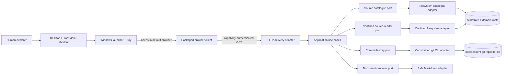

# MarkdownLLM Explorer — Design Specification

**Status:** implementation-reconciled, operator-accepted candidate; public Windows release remains gated by signing and signed-byte native verification

**Version:** 0.5

**Date:** 2026-08-27

**Requirements:** `explorer/docs/requirements.md` v0.4 in the same reconciled change set

**Architectural sources:** MarkdownLLM framework v3.36.0; Code Architect domain `c711d2a46225aaca471100e1eec2afceb02e751a`

## 1. Position

MarkdownLLM Explorer is a read-only local projection of an existing substrate and its nested domain repositories. It does not import domain state into a database, reinterpret git as application state, or put business rules into the browser. The product core remains one installable Python package containing:

- a pure domain/application core that models sources, ownership, documents, collections and commits;
- replaceable filesystem, git and Markdown adapters;
- a loopback HTTP delivery adapter; and
- a build-free browser client made from packaged HTML, CSS and native JavaScript modules.

On Windows that package is frozen into a self-contained application directory and wrapped in one native setup executable. End users see a Desktop application, not a Python environment. The substrate remains Markdown + YAML + directories + git. Explorer is a replaceable outside adapter.

## 2. Architectural decisions

### D-001 — Python, not Go

Python 3.10+ is the v1 delivery language. It aligns with the deterministic floor, makes path/git fixtures reusable, and satisfies the measured local workload without adding a second toolchain. Go would become justified only if the packaged Python runtime fails the distribution or performance contract; no current evidence says it will.

### D-002 — Standard-library HTTP at the edge

The delivery adapter uses `http.server.ThreadingHTTPServer` with a bounded-request mixin and explicit routing. FastAPI/Flask would improve routing convenience but introduce a framework and server dependency for seven GET APIs. HTTP stays outside the application boundary, so a later framework swap changes only delivery/composition and its tests.

### D-003 — Exactly pinned PyYAML is the only runtime package dependency

Frontmatter must support the YAML shapes real things use. The package therefore pins `PyYAML==6.0.3`, already exercised by the floor. YAML is parsed and normalised through constrained stages with byte, depth, scalar, collection and result-size limits. Markdown parsing and HTML presentation are separate Explorer-owned adapters: raw HTML is always escaped, and only required Markdown constructs are emitted. This avoids a CDN and avoids making active HTML somebody else's default.

### D-004 — Native browser modules, no build chain

Packaged ES modules provide state, routing, API access and focused view components. There is no Node runtime, bundler or runtime fetch of third-party assets. The browser client may be replaced without changing application use cases.

### D-005 — Capability-bearing loopback session

Loopback is necessary but insufficient. Each process generates a 256-bit capability and prints `http://127.0.0.1:<port>/#cap=<value>`. URL fragments never reach the HTTP request line or access logs. Bootstrap stores the value in `sessionStorage`, removes it from the visible URL with `history.replaceState`, and sends it only in `X-Explorer-Capability`. APIs also validate exact Host and Origin and compare the bounded header with `hmac.compare_digest`. Capability and cursor-HMAC keys are independent, in memory only and die with the process/browser session.

### D-006 — Shipped together, installed independently

`explorer/` lives in the public substrate repository and owns its own `pyproject.toml`, package assets, tests, console entry point and native packaging definitions. It neither imports `tools/mdllm.py` nor assumes a checkout-relative cwd. `pip install <checkout>/explorer` remains the developer/automation route; the Windows installer is the human route. Both target any conforming root selected at launch/install time.

### D-007 — One-folder frozen runtime inside one NSIS setup executable

PyInstaller freezes the Windows application as a one-folder bundle; NSIS packages that folder into the single setup `.exe` the user receives. A raw one-file PyInstaller executable was rejected because it must expand itself to a temporary directory on every launch, slows desktop startup and still provides no root selection, shortcuts, upgrade identity or uninstaller. NSIS is build-time infrastructure only. The installed runtime contains Python, PyYAML, browser assets and the Windows desktop adapter and requires no system interpreter.

The public build supplies a SignTool path, a certificate-store thumbprint and an HTTPS RFC 3161 timestamp URL as one fail-closed set. The build signs the frozen application before packaging; NSIS `!uninstfinalize` signs the generated uninstaller and `!finalize` signs the setup. SHA-256 is used for file and timestamp digests. An unsigned build remains a local development artefact, not a releasable Windows binary.

### D-008 — The desktop launcher is an outer driver

The existing CLI remains a console driver. `windows_app.py` is a separate Frameworks/Drivers entry point: it validates launch arguments, composes the existing runtime, owns browser and notification-area adapters, and coordinates shutdown. It adds no estate/domain policy and does not change application ports. PyInstaller/NSIS files live under `packaging/windows/` and never enter core/application packages.

### D-009 — Single-instance command channel, capability never persisted

The Windows launcher owns a per-user named mutex and named pipe. The first process keeps the capability-bearing URL only in memory and listens for the command `open`. A second shortcut activation sends only that command and exits; the existing process opens its own URL. The URL/capability is never written to registry, shortcut, disk or pipe. The only retained launch setting is the selected substrate root, stored by the installer under the current user's application key and repeated in shortcut arguments.

## 3. System context



All dependency arrows in source code point from outer adapters toward application-owned ports and pure models. Core/application modules import no HTTP, browser, subprocess, filesystem or YAML/HTML implementation.

## 4. Package and module layout

```text
explorer/
├── pyproject.toml
├── README.md
├── packaging/windows/
│   ├── build.ps1
│   ├── explorer.nsi
│   ├── launcher.py
│   ├── version-info.txt
│   └── assets/markdownllm-explorer.ico
├── docs/
│   ├── requirements.md
│   ├── design.md
│   └── test-specification.md
├── src/markdownllm_explorer/
│   ├── __init__.py
│   ├── __main__.py
│   ├── windows_app.py
│   ├── composition.py
│   ├── core/
│   │   ├── models.py
│   │   ├── errors.py
│   │   ├── limits.py
│   │   └── eligibility.py
│   ├── application/
│   │   ├── ports.py
│   │   ├── discover_estate.py
│   │   ├── get_overview.py
│   │   ├── browse_tree.py
│   │   ├── search_paths.py
│   │   ├── list_collection.py
│   │   ├── get_settings.py
│   │   └── read_document.py
│   ├── adapters/
│   │   ├── collection_reader.py
│   │   ├── confined_link_resolver.py
│   │   ├── filesystem_catalogue.py
│   │   ├── confined_source_reader.py
│   │   ├── cursors.py
│   │   ├── git_commit_history.py
│   │   ├── process_runner.py
│   │   ├── frontmatter_parser.py
│   │   ├── safe_markdown_parser.py
│   │   └── document_presenter.py
│   └── delivery/
│       ├── http_server.py
│       ├── api_routes.py
│       ├── response_encoding.py
│       └── static/
│           ├── index.html
│           ├── app.css
│           ├── context.css
│           └── js/
│               ├── app.js
│               ├── api.js
│               ├── state.js
│               ├── routing.js
│               ├── theme.js
│               ├── overlays.js
│               └── views/
│                   ├── navigation.js
│                   ├── overview.js
│                   ├── tree.js
│                   ├── collection.js
│                   ├── document.js
│                   ├── settings.js
│                   └── context.js
└── tests/
    ├── test_core.py
    ├── test_application.py
    ├── test_adapters.py
    ├── test_http.py
    ├── test_architecture.py
    ├── test_browser_state.py
    ├── test_windows_app.py
    ├── traceability.yaml
    └── evidence/
```

No module is named `manager`, `helper`, `utils` or generic `service`. Each application module implements one use case. `http_server.py` owns protocol/runtime concerns; `api_routes.py` owns route-to-use-case translation; neither contains source policy.

## 5. Core model

All core values are immutable dataclasses or enums.

| Model | Purpose | Key fields |
|---|---|---|
| `SourceId` | Validated opaque UI/API identity | `value` |
| `RelativePath` | Normalised source-relative POSIX path | `parts`, `display` |
| `BoundaryToken` | Opaque reference resolved only by outer adapters | `value` |
| `Source` | Source identity and public facts, with no native path | `id`, `kind`, `display_name`, `boundary_token`, `markers`, `git_kind` |
| `EstateSnapshot` | One atomic ownership/catalogue observation | `sources`, `issues`, `revision`, `observed_at` |
| `SourceIssue` | Non-fatal source discovery fact | `code`, `source_id?`, `message` |
| `SourceSettingsRecord` | Authenticated outer source facts | `source_id`, `source_path`, `markers`, `kind`, `git_kind` |
| `TreeNode` | One eligible directory/file row | `path`, `name`, `kind`, `size?`, `modified_at?`, `expandable` |
| `Page[T]` | Bounded deterministic page | `items`, `next_cursor`, `partial`, `observed_at` |
| `RepositoryState` | Git availability/state | `kind`, `head_sha?`, `branch?`, `dirty?`, `issue?` |
| `CommitRecord` | Read-only commit evidence | `sha`, `subject`, `author_name`, `authored_at` |
| `FrontmatterResult` | Parsed JSON-safe or explicitly invalid metadata | `state`, `values`, `error_code?` |
| `LinkCandidate` | Parsed, inactive document link | `label`, `raw_target`, `kind` |
| `DocumentRecord` | One requested document representation | `source_id`, `path`, `mode`, `content`, `frontmatter`, `links`, `size`, `modified_at`, `issues` |
| `CollectionItem` | Skill/memory route to a document | `path`, `title`, `group`, `thing_id?`, `thing_type?`, `issues` |

An adapter-owned `BoundaryRegistry` maps `BoundaryToken` to canonical roots, excluded/candidate roots and native git stores. Native paths never enter core/public DTOs; authenticated Settings obtains an explicitly redacted path field from a dedicated outer query.

## 6. Application-owned ports

```python
class SourceCatalogue(Protocol):
    def snapshot(self) -> EstateSnapshot: ...
    def source(self, source_id: SourceId) -> Source: ...

class SourceMetrics(Protocol):
    def overview_counts(self, source: Source) -> SourceCounts: ...

class DirectoryBrowser(Protocol):
    def list_directory(self, source: Source, path: RelativePath,
                       cursor: str | None) -> Page[TreeNode]: ...

class PathSearch(Protocol):
    def search(self, source: Source, query: str,
               cursor: str | None) -> Page[TreeNode]: ...

class CollectionReader(Protocol):
    def collection(self, source: Source, kind: CollectionKind,
                   cursor: str | None) -> Page[CollectionItem]: ...

class SourceSettings(Protocol):
    def settings(self, source: Source) -> SourceSettingsRecord: ...

class DocumentReader(Protocol):
    def read(self, source: Source, path: RelativePath) -> RawDocument: ...

class LinkResolver(Protocol):
    def resolve(self, source: Source, document: RelativePath,
                candidate: LinkCandidate) -> ResolvedLink: ...

class CommitHistory(Protocol):
    def repository_state(self, source: Source) -> RepositoryState: ...
    def commits(self, source: Source, cursor: str | None) -> Page[CommitRecord]: ...

class FrontmatterParser(Protocol):
    def parse(self, raw: RawDocument) -> ParsedDocument: ...

class MarkdownParser(Protocol):
    def parse(self, body: str) -> MarkdownTree: ...

class DocumentPresenter(Protocol):
    def present(self, tree: MarkdownTree,
                links: tuple[ResolvedLink, ...]) -> str: ...
```

The protocols contain domain nouns and bounded operations only. They do not expose arbitrary command arguments, filesystem handles, HTML templates or HTTP types.

## 7. Use cases

| Use case | One reason to change | Ports used |
|---|---|---|
| `DiscoverEstate` | Estate response semantics | `SourceCatalogue` |
| `GetOverview` | Source summary composition | catalogue, metrics, history |
| `BrowseTree` | Directory-page semantics | catalogue, directory browser |
| `SearchPaths` | Query validation and result semantics | catalogue, path search |
| `ListCollection` | Skills/memory grouping contract | catalogue, collection reader |
| `GetSettings` | Authenticated read-only source-path facts | catalogue, source settings |
| `ReadDocument` | Mode-specific read/parse/link/present orchestration | catalogue, document reader, frontmatter parser, Markdown parser, link resolver, presenter |

Use cases validate IDs/query shapes, call ports and return models. They do not catch generic exceptions. Expected core/application errors are typed; the single delivery boundary maps unknown failures to `internal_error` and logs only operation/request/source identity.

## 8. Exclusive source discovery

`FilesystemSourceCatalogue` and its adapter-owned `BoundaryRegistry` are constructed with an explicit launch root and source-relative domain directory.

1. Validate the root is an existing readable directory and not a reparse point/symlink.
2. Validate the domain directory input is relative, contains no `..`, drive, UNC or device prefix, and resolves beneath root.
3. Register the entire configured domain-directory canonical root as an unconditional substrate exclusion before inspecting any child. Substrate tree/search/read never enters it, so new, collided, unreadable and rejected domain candidates cannot fall through to substrate ownership.
4. Inspect exactly one child level using bounded non-following enumeration. Apply ignored/secret rules to directory names, not file-extension rules. Record candidate outcomes as `admitted`, `marker_missing`, `unreadable`, `reparse_rejected`, `id_collision` or `invalid_marker`; only readable directories carrying `AGENTS.md` or `.markdownllm` are navigable.
5. Derive source IDs using the requirements algorithm; report normalisation collisions.
6. Sort admitted sources by NFC/case-folded display name and original relative path; create domain identity values and private boundary-registry entries.
7. Create the substrate identity value and its private boundary entry carrying the unconditional domain-directory exclusion.
8. Detect git only from a local `.git` directory or worktree file and validate the resolved top-level/store policy in §10; never infer a domain repository from a parent `.git`.

The catalogue snapshot and boundary registry are built together and published atomically at process start. Every request receives the same revision; a restart is the v1 domain-add/remove refresh. The unconditional domain-directory exclusion remains safe while the process lives. Files and git content remain live reads, stamped `observed_at`; there is no shadow content cache.

## 9. Path eligibility and confinement

`EligibilityPolicy` is a pure core object built from the normative extension, name, secret-pattern, ignored-directory and size tables. Eligibility is applied before anything enters tree, search, collection, overview or document output.

For each adapter operation, `ConfinedSourceReader`:

1. Parses only percent-decoded source-relative POSIX paths; rejects backslashes, empty/internal `.` segments, `..`, drive/UNC/device syntax and NUL.
2. Applies depth, ignored-name and secret-name policy to every component; extension/name allowlisting applies only to the final regular file.
3. Uses adapter-private boundary data to walk components with non-following metadata calls, rejecting symlinks, junctions/reparse points and non-regular final types.
4. Resolves the candidate and proves it is within the token's canonical root and outside its excluded roots (for substrate, the entire configured domain directory).
5. Captures final non-following identity and metadata immediately before I/O.
6. Opens the already-confined candidate in binary read mode, compares the open handle's `fstat` identity with the pre-open identity, reads at most limit+1, and compares open-handle and final path identity/size/mtime after the read. On Windows, `GetFinalPathNameByHandleW` resolves the native open handle and repeats source/exclusion ownership checks before any content is returned. A fully privileged process able to replace a path between these checks remains outside the local v1 trust boundary; the adapter does not claim portable `openat`/`O_NOFOLLOW` race elimination.
7. For directory enumeration, captures non-following directory identity/mtime, performs a bounded `os.scandir` without following children, and compares identity/mtime after the scan. A detected rename/replacement returns `source_changed`.
8. Fails with `source_changed` when stable identity cannot be demonstrated.

This is defence in depth for a local read surface and matches requirements v0.4. Directory enumeration remains path-based. Tests record the executed filesystem/OS profile and prove ordinary link/reparse/replacement cases fail closed without promoting the residual privileged-race exclusion into a stronger claim.

Directory depth counts directories below the source root and is inclusive. A directory exactly at the configured depth remains listable and its eligible files appear consistently in tree, search, overview counts and curated collections. Deeper directories are omitted; the affected tree/search/collection page and overview counts carry `partial: true`, and requesting a deeper tree path returns `directory_limit`.

Cursors are one exact operation-bound canonical JSON shape, base64url encoded with a truncated HMAC-SHA256 signature from a cursor-only process key: `{context,offset,operation,revision,source}`. Tree uses the relative directory as `context`; search uses the case-folded query; collection uses its kind; commits use `HEAD`. `revision` is the bounded result fingerprint for filesystem operations and the pinned full commit SHA for history. Traversal is capped at 10,000 eligible candidates and reports `partial: true` when the candidate or depth boundary truncates visibility.

Directory/search fingerprints hash the bounded ordered identity fields actually paged, not file bodies. A changed fingerprint returns `source_changed`; malformed/tampered cursors return `invalid_cursor` and cannot inject paths or offsets.

## 10. Git adapter

`GitCommitHistory` owns the only subprocess use. At process start, before adopting any source cwd, composition resolves `git` with the trusted launch environment, requires a regular executable outside every source root, stores its absolute canonical path and passes that path to the adapter. The adapter accepts a `Source`, never a command from a controller.

Allowed operations are fixed internal templates:

- repository top-level, absolute git-dir/common-dir and `HEAD` verification;
- branch/detached/unborn state;
- porcelain-v2 status with untracked enumeration disabled; and
- a 51-record, NUL-delimited `git log <pinned-head> --topo-order --skip=<cursor-skip>` page (50 returned, one look-ahead).

Every process invokes that exact executable with an argument list, `shell=False`, exact adapter-registry cwd, three-second timeout and 1 MiB combined-output cap. The environment is built from an OS execution allowlist, not copied wholesale, and includes `GIT_TERMINAL_PROMPT=0`, `GIT_OPTIONAL_LOCKS=0`, `GIT_NO_LAZY_FETCH=1`, `GIT_PAGER=cat`, `PAGER=cat`, `GIT_EXTERNAL_DIFF=`, null global/system config paths and no `GIT_DIR`, worktree, object, replace-ref, SSH/askpass or optional-lock variables. Command-line config disables hooks path, fsmonitor, untracked cache, index preload, external diff and pager.

Before adopting a source as git-backed, the adapter validates top-level equals the registered source root and both absolute git-dir and common-dir remain inside it; external worktree/common/object stores are reported as `git_store_external` and history is unavailable in v1. That keeps every git-read target inside AJ-07's snapshot. No aliases or repository-derived executable paths are used, and a process-spawn probe proves only the trusted executable is invoked.

Commit parsing uses full SHA as identity and displays 12 characters (full SHA remains in the DTO). The signed cursor is `{v,source,pinned_head,skip}`. First page pins the current full `HEAD`; later pages rerun the same topological order at that pinned head with an increasing skip, so new commits do not reorder the walk. A missing pinned commit yields `source_changed`.

## 11. Frontmatter, Markdown and link pipeline

Three focused adapters and one confined resolver form the document pipeline.

1. `BoundedFrontmatterParser` recognises only a leading `---` block terminated by a standalone `---` within 128 KiB. It rejects aliases entirely, duplicate/merge keys, unsupported tags, recursive structures, depth >20, scalar >64 KiB, sequence/mapping cardinality >2,000 and composed nodes >10,000. It normalises only JSON values (`null`, bool, bounded integer/finite float, string, list, string-keyed map) and caps the compact UTF-8 JSON form at 256 KiB. Dates, sets, binary and custom values become bounded strings only when they originated from plain YAML scalars; explicit unsupported tags fail. Invalid input yields `frontmatter_invalid`, empty inferred metadata and escaped raw access.
2. `SafeSubsetMarkdownParser` produces an inert tree containing text, block nodes and `LinkCandidate` values. Raw HTML is text, not a node type. Fenced code, headings, paragraphs, emphasis, lists, blockquotes, pipe tables and horizontal rules are covered by corpus-derived goldens.
3. `ConfinedLinkResolver` resolves relative candidates against the source document through the same eligibility/ownership adapter. Only an existing eligible same-source Markdown file becomes an Explorer route. `http`/`https` candidates become labelled external links; encoded/control-character schemes, images/subresources, every other scheme and unresolved/excluded targets remain inert. Navigation repeats confinement; rendering grants no authority.
4. `AllowlistDocumentPresenter` emits only `h1`–`h6`, `p`, `strong`, `em`, `code`, `pre`, `ul`, `ol`, `li`, `blockquote`, `table`, `thead`, `tbody`, `tr`, `th`, `td`, `hr` and validated `a`. It emits no content-supplied style/class, image, iframe, SVG, form or event attribute; external anchors receive `target="_blank" rel="noopener noreferrer external"`.

`ReadDocument(mode=raw)` skips Markdown parsing and returns escaped text data; `mode=rendered` runs the pipeline and returns HTML. Exactly one representation is serialised. The browser inserts rendered HTML only into the dedicated document container. Every other repository value uses DOM `textContent`; raw mode always uses a `<pre><code>` text node.

## 12. HTTP API

Static assets are source-insensitive. `/health` is unauthenticated and returns only `{status, version}`. Exact `Host: 127.0.0.1:<bound-port>` is required on static, health and API routes. Static/health navigation allows absent Origin or the exact launch origin; APIs allow absent Origin for direct tools or the exact launch origin and always require the capability. No route emits CORS headers.

| Method/path | Use case | Key query |
|---|---|---|
| `GET /api/v1/estate` | `DiscoverEstate` | — |
| `GET /api/v1/overview` | `GetOverview` | `source`, `cursor?` |
| `GET /api/v1/tree` | `BrowseTree` | `source`, `path?`, `cursor?` |
| `GET /api/v1/search` | `SearchPaths` | `source`, `q`, `cursor?` |
| `GET /api/v1/collection` | `ListCollection` | `source`, `kind=skills|memory`, `cursor?` |
| `GET /api/v1/settings` | `GetSettings` | `source` |
| `GET /api/v1/document` | `ReadDocument` | `source`, `path`, `mode=raw|rendered` |

Success uses `{data, meta: {request_id, observed_at, next_cursor?, partial?}}`. Public DTOs are defined in `response_encoding.py`; conversion is explicit and never serialises core/adaptor dataclasses directly. Common shapes are:

```json
{"data":{"sources":[{"id":"substrate","kind":"substrate","display_name":"Substrate","markers":["AGENTS.md"],"git_kind":"repository"}],"issues":[]},"meta":{"request_id":"…","observed_at":"…"}}
{"data":{"source_id":"substrate","path":"thing.md","mode":"rendered","content":"<h1>…</h1>","frontmatter":{"state":"valid","values":{"id":"thing-specification"}},"size":123,"modified_at":"…","issues":[]},"meta":{"request_id":"…","observed_at":"…"}}
{"error":{"code":"path_excluded","message":"The requested path is not available.","retryable":false,"source_id":"substrate","relative_path":".env"},"meta":{"request_id":"…"}}
```

Tree/search/collection/commit page DTOs carry `items`, with `next_cursor`/`partial` in `meta`; absent optional values are omitted rather than `null`. Settings alone may include `source_path` after capability/Host/Origin checks. Error mapping is one typed exception to one status/code/retryability value; absolute paths and document bodies are never accepted by the encoder.

| HTTP | Stable codes |
|---:|---|
| 400 | `invalid_request`, `invalid_path`, `invalid_cursor`, `invalid_query` |
| 401 | `capability_required`, `capability_invalid` |
| 403 | `host_forbidden`, `origin_forbidden`, `path_excluded`, `path_outside_source` |
| 404 | `route_not_found`, `source_not_found`, `file_not_found` |
| 405 | `method_not_allowed` |
| 409 | `source_changed`, `source_id_collision`, `path_type_changed` |
| 413 | `file_too_large`, `response_too_large`, `directory_limit` |
| 415 | `binary_unsupported`, `encoding_unsupported` |
| 429 | `server_busy` |
| 503 | `source_unreadable`, `git_unavailable`, `git_timeout`, `git_store_external` |
| 500 | `internal_error` |

`frontmatter_invalid` is a 200 document result with an issue because raw inspection remains available. Invalid/auth/path/limit/unsupported failures are non-retryable; `source_changed`, `server_busy`, `git_timeout` and transient `source_unreadable` are retryable; unknown/internal and external-store policy failures are non-retryable. Before JSON serialisation, response encoding estimates the compact UTF-8 representation and returns `response_too_large` without a partial document when it would exceed 2 MiB. All responses carry CSP, no-store, nosniff, no-referrer and frame-denial headers. API responses use `application/json; charset=utf-8`; assets use fixed MIME types. Unsupported methods return HTTP 405/`method_not_allowed` without invoking a use case.

`BoundedThreadingHTTPServer` overrides `process_request`: it acquires one of 16 permits non-blockingly before creating a thread; when full it sends a fixed bounded HTTP 429 JSON response directly and closes the socket. The handler subclasses `BaseHTTPRequestHandler`, never `SimpleHTTPRequestHandler`, and maps only `/`, `/health`, `/api/v1/*` plus an exact immutable `importlib.resources` asset manifest. Request-line/header limits and controllable parse failures produce bounded errors; access/error logging emits structured redacted method/route/status/request ID and never the fragment, capability header, query string or document values.

Socket/request deadlines and browser-side 10-second aborts guarantee a visible client terminal state. Python cannot cancel a thread blocked inside an arbitrary filesystem syscall; that residual is bounded by the 16-request ceiling and is not misreported as server-side cancellation. Application/adapters own only failures they can classify meaningfully; the request boundary handles the rest once.

## 13. Browser application

### State and routing

The single state object contains the estate/current source, active view/path/mode/theme, search state, open directories, paged tree entries/cursors/partial flags, source context, repository context and current-request records. `state.js` owns request identity, abort and stale-response checks; workflow coordinators mutate only that explicit object and passive view modules receive the values and callbacks they render.

The hash route contains only source ID, tab, mode and percent-encoded relative path. `routing.js` round-trips it and `app.js` applies back/forward restoration. Ancestors of the selected path are derived as expanded; additional expansions live in session state. Skills and Memory restoration first reloads the curated collection shell, then opens the routed document in its embedded reader so refresh/back/forward preserve the visible collection mental model.

Each API operation and document mode owns an `AbortController` and monotonically increasing request ID. A source/tab/path/mode change aborts obsolete work. A response mutates state only when its full operation/source/path/mode identity is still current, closing the stale-response race. A 401 after process restart becomes a distinct `session_expired` view with relaunch guidance; it never clears the last safe location.

### Visual composition

Desktop (≥900 CSS px) is a grid with:

- **Estate rail (280 px):** Explorer mark, Substrate disclosure, Domains disclosure, nested tree/search.
- **Evidence pane (minmax 0/1fr):** source header, Overview/Skills/Memory/Settings tabs, commit/collection/document content.
- **Context panel (320 px):** factual source or document metadata and theme control.

The aesthetic follows the reference's quiet density: near-black/near-white surfaces, hairline borders, 8/12/16 px spacing rhythm, rounded but restrained controls, one teal accent, and system font stack. It carries no Perplexity branding or irrelevant share/account/session controls.

Below 900 px, header buttons open rail/context as modal overlays with labelled dialogs, focus trap, Escape close and focus return. At 320 CSS px/200% zoom, content is one column and tables/code scroll within their own region rather than widening the page.

### Accessibility and theme

The source tree is one `role="tree"` with nested `role="group"`/`treeitem` rows, `aria-expanded` on directories, `aria-selected` on the active document and one roving `tabindex=0`. Arrow Up/Down moves visible rows; Right expands or enters; Left collapses or moves to parent; Home/End move bounds; Enter activates. Collapsing/removing the focused descendant moves focus to the owning directory. A paginated “Load more” keeps focus on the first added item or the button when no item is added.

Tabs use `tablist`/`tab`/`tabpanel` with Arrow/Home/End and stable focus. Responsive overlays are labelled dialogs; the background becomes `inert`, focus is trapped, Escape closes, and focus returns to the opener. Async status uses one de-duplicating `aria-live="polite"` region; fatal/load errors use `role="alert"` once. Routing, theme and responsive-overlay state machines are isolated in `routing.js`, `theme.js` and `overlays.js`. View modules render DOM and dispatch intents only: `overview.js`, `collection.js`, `document.js`, `settings.js`, `navigation.js` and `context.js` do not fetch or own cross-view state.

CSS custom properties define light/dark tokens. `theme.js` applies `light`, `dark` or `system`, listens for system changes only in system mode, and persists only the explicit mode in `localStorage`. Reduced-motion preference removes non-essential transitions.

## 14. Distribution and composition

`pyproject.toml` uses a `src/` package, includes static assets as package data, pins `PyYAML==6.0.3`, requires Python `>=3.10`, and exposes:

```toml
[project.scripts]
mdllm-explorer = "markdownllm_explorer.__main__:main"
```

`__main__.py` parses `--root`, `--domain-dir` (default `domain`) and `--port` (default 0), validates configuration, and calls `composition.build_runtime` followed by `composition.build_server`. Composition constructs limits/policy, catalogue/boundary registry, focused filesystem ports, Git adapter, frontmatter/Markdown/presenter pipeline, use cases and the selected HTTP adapter. No global singleton is created at import time.

Startup prints product/version, resolved root and fragment-capability URL. `KeyboardInterrupt` initiates `shutdown`, closes the listening socket and joins active request threads up to five seconds. The portable runtime creates no persistent state; interpreter-managed package bytecode caches outside source roots are permitted by requirements v0.4 and a read-only installed-package system test proves launch does not depend on writing them.

### Windows packaging and launch

`packaging/windows/build.ps1` is the reproducible build boundary. It invokes an exactly pinned PyInstaller build environment, produces a one-folder `MarkdownLLM Explorer.exe`, then invokes NSIS 3.12+ to produce `MarkdownLLM-Explorer-Installer-<version>.exe`. Build outputs live under ignored `explorer/build/` and `explorer/dist/`; the source definitions, hashes and verification evidence are committed, while publication of the installer remains a separate release act.

The setup runs per user (`RequestExecutionLevel user`) into `%LOCALAPPDATA%\Programs\MarkdownLLM Explorer`, so installation needs no elevation. A custom page selects a directory containing `AGENTS.md`; silent verification supplies `/SUBSTRATEROOT=<path>`. Setup stores only that root under `HKCU\Software\MarkdownLLM Explorer`, writes one Desktop and one Start Menu shortcut with quoted `--root`, registers the uninstaller, and offers to launch the app on completion. Before reinstallation or uninstall mutates installed files, it invokes `--request-exit` and aborts on any non-zero result. Reinstallation then reads the previous root, replaces the application directory and recreates singleton shortcuts. Uninstall removes those exact owned surfaces and no source-root path.

`windows_app.py` parses the same root/domain/port contract plus packaging-only `--no-browser`, `--no-tray` and `--request-exit` verification/lifecycle switches. On first instance it acquires a current-user mutex, starts the existing bounded HTTP server on a worker thread, creates the tray menu (**Open Explorer**, **Exit Explorer**) and opens the URL through the Windows default-browser association. On reactivation it sends `open` to the first process over the current-user named pipe and exits. For `exit`, the primary acknowledges its PID before beginning shutdown; the secondary opens that process with synchronisation rights and waits up to 15 seconds for process termination. Exit calls server shutdown, closes the listener/socket and joins active requests within the existing five-second budget. Setup therefore waits for positive primary-process termination, not merely the short-lived command sender. Startup failures surface one bounded native message box because a windowed executable has no console.

The frozen application imports `pystray`/Pillow only at this outer Windows delivery edge; those packages are bundled build inputs, not dependencies of core/application or of the portable CLI package. The application icon is the Explorer `M` mark supplied as a multi-resolution `.ico` and used consistently by the executable, setup, Desktop shortcut and tray.

### Performance allocation

The benchmark owns one overall deadline per request rather than allowing each adapter its full timeout serially. Estate discovery + first overview allocates 400 ms catalogue/count scan, 500 ms repository state, 500 ms commit page and 300 ms encoding/HTTP, with 300 ms margin; overview runs independent metrics/state/history work concurrently through a bounded three-task executor and cancels/labels unavailable work at the overall two-second deadline. Tree lists one directory only. Search/collection stop at 10,000 candidates and return `partial`. Git's three-second process timeout is a safety ceiling; the performance fixture expects the tighter 500 ms page budget and records failure when it misses.

## 15. Test seams and fitness rules

- Core eligibility, identity and models use no filesystem/git/browser and receive exhaustive unit/property-like tables.
- Each use case is constructed with its smallest fake port; a test runs with git absent from `PATH` and network disabled.
- Filesystem and git adapters are contract-tested against temporary captured-real repositories.
- Frontmatter, Markdown-tree, link-resolution and presentation contract tests are independent; corpus goldens cover fidelity, and a separate safety oracle asserts forbidden tags/attributes/schemes are absent.
- HTTP system tests start a real loopback server and exercise capability, Host/Origin, headers, limits and error shapes.
- Browser runtime validation uses the available in-app Chromium surface at required viewports and captures screenshots/DOM/accessibility evidence.
- Windows distribution validation builds from a clean ignored directory, inspects the PE/version/data manifest, installs silently without network or Python discovery, checks exact shortcut target/arguments and uninstall registration, launches the frozen executable against a temporary substrate, tests reactivation and tray-driven shutdown, reinstalls over itself, then uninstalls and compares source/outside snapshots.
- Architecture fitness parses imports and rejects `pathlib`, `os`, `subprocess`, HTTP or renderer implementations in `core/`/`application/`; rejects any inner import from `adapters`/`delivery`; permits concrete adapter imports only in `composition.py`; runs shared contracts against fake/real ports; and rejects browser view modules that call `fetch` or mutate the global state directly.
- A retained adapter-swap fixture independently substitutes the HTTP server, Git reader, confined filesystem reader and Markdown renderer, runs a runtime probe for each, and proves every changed-path set is exactly composition plus one outer adapter with no core/application change.
- A mutation/misconfiguration suite proves tests fail when ownership checks, capability checks, escaping, git no-lock environment, size limits or stale-response guards are deliberately removed.

## 16. Requirement allocation

| Requirement family | Primary design home |
|---|---|
| FR-EST, FR-NAV source/tree | catalogue, confined reader, navigation/router |
| FR-TAB | overview/collection use cases and content view |
| FR-DOC | confined reader, Markdown renderer, document/context views |
| FR-SRCH | search use case, reader and navigation view |
| FR-UI | browser shell, theme and CSS |
| FR-RUN | packaging, CLI, composition and HTTP runtime |
| FR-ERR | typed errors, response encoding and async state |
| NFR-ARCH | ports, package rules and fitness tests |
| NFR-SAFE | eligibility/confinement, git adapter, renderer and HTTP boundary |
| NFR-PORT/OFF/PERF | package/runtime, build-free assets and benchmark harness |
| NFR-ACC | semantic view components and browser evidence |
| NFR-TEST/OBS | test harness and outer logging boundary |

The test specification must turn this allocation into one row per requirement ID before implementation begins.

## 17. Known trade-offs and review questions

- The safe Markdown subset deliberately escapes raw HTML and omits images. Fidelity is constrained in favour of a smaller active-content boundary; real corpus goldens decide whether the subset is sufficient.
- The source catalogue is fixed for one process. Restart is the v1 domain-add/remove refresh; file and commit reads remain live. A manual refresh control can follow after the visibility hypothesis is accepted.
- The standard-library server is intentionally small. If route/protocol complexity grows beyond this seven-GET surface, the HTTP adapter should be replaced, not expanded into application logic.
- Full adversarial filesystem race resistance is OS-specific. v1 uses native handle/identity evidence and fails closed on disagreement; it does not claim protection from a fully privileged local attacker controlling the same machine.
- Chromium runtime evidence is achievable in this environment. Firefox/Safari compatibility remains standards-backed and must be described as unexecuted until those browsers are actually exercised.
- The Windows setup and application are structurally ready for Authenticode signing but this repository has no signing certificate. Local/test builds can show an unknown-publisher warning or be blocked completely by Smart App Control / enterprise code-integrity policy. A public Windows release must sign both executable and setup in a separately authorised release process, then repeat the native lifecycle proof on those exact signed bytes.
- Linux and macOS native installers are deliberately outside this increment. The portable Python package remains their verified execution route until each platform earns its own packaging design and runtime evidence.
