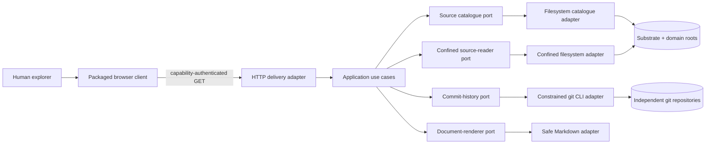

# MarkdownLLM Explorer — Design Specification

**Status:** draft awaiting cold design review

**Version:** 0.1

**Date:** 2026-08-27

**Requirements:** `explorer/docs/requirements.md` v0.2 at repository view `e276ac3b2430a0f0d1844a0806bb155a5bb9620d`

**Architectural sources:** MarkdownLLM framework `7bffcb162f01c5cc6afb98756eca58bc5c5f79fe`; Code Architect domain `c711d2a46225aaca471100e1eec2afceb02e751a`

## 1. Position

MarkdownLLM Explorer is a read-only local projection of an existing substrate and its nested domain repositories. It does not import domain state into a database, reinterpret git as application state, or put business rules into the browser. The product is one installable Python package containing:

- a pure domain/application core that models sources, ownership, documents, collections and commits;
- replaceable filesystem, git and Markdown adapters;
- a loopback HTTP delivery adapter; and
- a build-free browser client made from packaged HTML, CSS and native JavaScript modules.

The substrate remains Markdown + YAML + directories + git. Explorer is a replaceable outside adapter.

## 2. Architectural decisions

### D-001 — Python, not Go

Python 3.10+ is the v1 delivery language. It aligns with the deterministic floor, makes path/git fixtures reusable, and satisfies the measured local workload without adding a second toolchain. Go would become justified only if the packaged Python runtime fails the distribution or performance contract; no current evidence says it will.

### D-002 — Standard-library HTTP at the edge

The delivery adapter uses `http.server.ThreadingHTTPServer` with a bounded-request mixin and explicit routing. FastAPI/Flask would improve routing convenience but introduce a framework and server dependency for six GET APIs. HTTP stays outside the application boundary, so a later framework swap changes only delivery/composition and its tests.

### D-003 — PyYAML is the only runtime package dependency

Frontmatter must support the YAML shapes real things use. The package therefore pins PyYAML, already exercised by the floor. YAML is parsed through a constrained `SafeLoader` with byte, alias and node limits. Markdown rendering is an Explorer-owned safe-subset adapter: raw HTML is always escaped, and only required Markdown constructs are emitted. This avoids a CDN and avoids making active HTML somebody else's default.

### D-004 — Native browser modules, no build chain

Packaged ES modules provide state, routing, API access and focused view components. There is no Node runtime, bundler or runtime fetch of third-party assets. The browser client may be replaced without changing application use cases.

### D-005 — Capability-bearing loopback session

Loopback is necessary but insufficient. Each process generates a 256-bit capability and prints `http://127.0.0.1:<port>/?cap=<value>`. Bootstrap stores it in `sessionStorage`, removes it from the visible URL with `history.replaceState`, and sends it only in `X-MDLLM-Capability`. APIs also validate exact Host and Origin. The capability is in memory only and dies with the process/browser session.

### D-006 — Shipped together, installed independently

`explorer/` lives in the public substrate repository and owns its own `pyproject.toml`, package assets, tests and console entry point. It neither imports `tools/mdllm.py` nor assumes a checkout-relative cwd. `pip install <checkout>/explorer` produces `mdllm-explorer` usable against any conforming root.

## 3. System context



All dependency arrows in source code point from outer adapters toward application-owned ports and pure models. Core/application modules import no HTTP, browser, subprocess, filesystem or YAML/HTML implementation.

## 4. Package and module layout

```text
explorer/
├── pyproject.toml
├── README.md
├── docs/
│   ├── requirements.md
│   ├── design.md
│   └── test-specification.md
├── src/markdownllm_explorer/
│   ├── __init__.py
│   ├── __main__.py
│   ├── composition.py
│   ├── core/
│   │   ├── models.py
│   │   ├── errors.py
│   │   ├── limits.py
│   │   └── eligibility.py
│   ├── application/
│   │   ├── ports.py
│   │   ├── discover_estate.py
│   │   ├── get_overview.py
│   │   ├── browse_tree.py
│   │   ├── search_paths.py
│   │   ├── list_collection.py
│   │   └── read_document.py
│   ├── adapters/
│   │   ├── filesystem_catalogue.py
│   │   ├── confined_source_reader.py
│   │   ├── git_commit_history.py
│   │   └── safe_markdown.py
│   └── delivery/
│       ├── http_server.py
│       ├── api_routes.py
│       ├── response_encoding.py
│       └── static/
│           ├── index.html
│           ├── styles.css
│           └── js/
│               ├── main.js
│               ├── api.js
│               ├── state.js
│               ├── router.js
│               ├── theme.js
│               └── views/
│                   ├── navigation.js
│                   ├── content.js
│                   └── context_panel.js
└── tests/
    ├── unit/
    ├── contract/
    ├── gitfs/
    ├── system/
    ├── fixtures/
    └── evidence/
```

No module is named `manager`, `helper`, `utils` or generic `service`. Each application module implements one use case. `http_server.py` owns protocol/runtime concerns; `api_routes.py` owns route-to-use-case translation; neither contains source policy.

## 5. Core model

All core values are immutable dataclasses or enums.

| Model | Purpose | Key fields |
|---|---|---|
| `SourceId` | Validated opaque UI/API identity | `value` |
| `RelativePath` | Normalised source-relative POSIX path | `parts`, `display` |
| `Source` | One exclusive source boundary | `id`, `kind`, `display_name`, `canonical_root`, `markers`, `git_kind`, `excluded_roots` |
| `EstateSnapshot` | Catalogue result at one observation | `sources`, `issues`, `observed_at` |
| `SourceIssue` | Non-fatal source discovery fact | `code`, `source_id?`, `message` |
| `TreeNode` | One eligible directory/file row | `path`, `name`, `kind`, `size?`, `modified_at?`, `expandable` |
| `Page[T]` | Bounded deterministic page | `items`, `next_cursor`, `partial`, `observed_at` |
| `RepositoryState` | Git availability/state | `kind`, `head_sha?`, `branch?`, `dirty?`, `issue?` |
| `CommitRecord` | Read-only commit evidence | `sha`, `subject`, `author_name`, `authored_at` |
| `FrontmatterResult` | Parsed or explicitly invalid metadata | `state`, `values`, `error_code?` |
| `DocumentRecord` | Safe document result | `source_id`, `path`, `media_kind`, `raw_text?`, `rendered_html?`, `frontmatter`, `size`, `modified_at`, `issues` |
| `CollectionItem` | Skill/memory route to a document | `path`, `title`, `group`, `thing_id?`, `thing_type?`, `issues` |

`Source.canonical_root` is infrastructure-sensitive data carried as an opaque `Path` value for adapters; it is never embedded in `SourceId` or default error output.

## 6. Application-owned ports

```python
class SourceCatalogue(Protocol):
    def snapshot(self) -> EstateSnapshot: ...
    def source(self, source_id: SourceId) -> Source: ...

class ConfinedSourceView(Protocol):
    def overview_counts(self, source: Source) -> SourceCounts: ...
    def list_directory(self, source: Source, path: RelativePath,
                       cursor: str | None) -> Page[TreeNode]: ...
    def search(self, source: Source, query: str,
               cursor: str | None) -> Page[TreeNode]: ...
    def collection(self, source: Source, kind: CollectionKind,
                   cursor: str | None) -> Page[CollectionItem]: ...
    def read(self, source: Source, path: RelativePath) -> RawDocument: ...

class CommitHistory(Protocol):
    def repository_state(self, source: Source) -> RepositoryState: ...
    def commits(self, source: Source, cursor: str | None) -> Page[CommitRecord]: ...

class DocumentRenderer(Protocol):
    def render(self, raw: RawDocument) -> RenderedDocument: ...
```

The protocols contain domain nouns and bounded operations only. They do not expose arbitrary command arguments, filesystem handles, HTML templates or HTTP types.

## 7. Use cases

| Use case | One reason to change | Ports used |
|---|---|---|
| `DiscoverEstate` | Estate response semantics | `SourceCatalogue` |
| `GetOverview` | Source summary composition | catalogue, source view, history |
| `BrowseTree` | Directory-page semantics | catalogue, source view |
| `SearchPaths` | Query validation and result semantics | catalogue, source view |
| `ListCollection` | Skills/memory grouping contract | catalogue, source view |
| `ReadDocument` | Document read + render orchestration | catalogue, source view, renderer |

Use cases validate IDs/query shapes, call ports and return models. They do not catch generic exceptions. Expected core/application errors are typed; the single delivery boundary maps unknown failures to `internal_error` and logs only operation/request/source identity.

## 8. Exclusive source discovery

`FilesystemSourceCatalogue` is constructed with an explicit launch root and source-relative domain directory.

1. Validate the root is an existing readable directory and not a reparse point/symlink.
2. Validate the domain directory input is relative, contains no `..`, drive, UNC or device prefix, and resolves beneath root.
3. Inspect exactly one child level using `os.scandir`; never follow links.
4. Admit readable directories carrying `AGENTS.md` or `.markdownllm`.
5. Derive source IDs using the requirements algorithm; report normalisation collisions.
6. Create domain `Source` values first.
7. Create the substrate `Source` with every admitted domain canonical root in `excluded_roots`.
8. Detect git by a local `.git` directory or worktree file; never infer a domain repository from a parent `.git`.

The catalogue snapshot is built at process start and immutable for that process. A restart is the v1 refresh mechanism. Files and git content remain live reads, stamped `observed_at`; there is no shadow content cache.

## 9. Path eligibility and confinement

`EligibilityPolicy` is a pure core object built from the normative extension, name, secret-pattern, ignored-directory and size tables. Eligibility is applied before anything enters tree, search, collection, overview or document output.

For each adapter operation, `ConfinedSourceReader`:

1. Parses only percent-decoded source-relative POSIX paths; rejects backslashes, empty/internal `.` segments, `..`, drive/UNC/device syntax and NUL.
2. Applies depth, ignored-name, secret-name and extension policy to every component.
3. Walks components with non-following metadata calls, rejecting symlinks, junctions/reparse points and non-regular final types.
4. Resolves the candidate and proves it is within `canonical_root` and outside every `excluded_root`.
5. Captures parent/final identity and metadata immediately before I/O.
6. For file reads, opens read-only with no-follow semantics where the OS exposes them, validates the final native handle path/identity against the source boundary, reads at most limit+1 bytes, and compares identity/size/mtime after read. Platform adapters use `O_NOFOLLOW`/`fstat` on POSIX and reparse-point attributes plus final-handle path validation on Windows.
7. For directory enumeration, compares directory identity/mtime before and after the bounded scan.
8. Fails with `source_changed` when stable identity cannot be demonstrated.

This is defence in depth for a local read surface. A process with authority to replace directories at the exact instant of every check is outside the v1 trust boundary; the adapter still detects ordinary replacement races and fails closed whenever the native evidence disagrees.

Pagination cursors are canonical JSON (`version`, source ID, operation, relative path/query, offset and directory/result fingerprint), base64url encoded and HMAC-signed with a per-process cursor key. A changed fingerprint returns `source_changed`; client-supplied offsets or paths cannot be smuggled in a cursor.

## 10. Git adapter

`GitCommitHistory` owns the only subprocess use. It accepts a `Source`, never a command from a controller.

Allowed operations are fixed internal templates:

- repository root and `HEAD` verification;
- branch/detached/unborn state;
- porcelain-v2 status with untracked enumeration disabled; and
- a 51-record, NUL-delimited `git log HEAD --topo-order` page (50 returned, one look-ahead).

Every process uses an argument list with `shell=False`, exact source cwd, three-second timeout and 1 MiB combined-output cap. The environment is a minimal copy containing required OS execution variables plus `GIT_TERMINAL_PROMPT=0`, `GIT_OPTIONAL_LOCKS=0`, `GIT_PAGER=cat`, `PAGER=cat`, `GIT_EXTERNAL_DIFF=` and null global/system config paths; command-line config disables hooks path, fsmonitor, untracked cache, index preload, external diff and pager. The adapter validates `rev-parse --show-toplevel` equals the source canonical root before any history call. It never invokes an alias or accepts repository-derived executable paths.

Commit parsing uses full SHA as identity, displays at least 10 characters and expands colliding abbreviations within the returned page. Cursor state carries the last full SHA and query fingerprint, not a numeric offset into changing history.

## 11. Markdown/frontmatter adapter

`SafeMarkdownRenderer` receives bounded UTF-8 text and returns HTML from an allowlist it owns.

- Frontmatter is recognised only as a leading `---` block terminated by a standalone `---` within 128 KiB.
- `BoundedSafeLoader` rejects more than 100 aliases, 10,000 composed nodes, duplicate mapping keys and non-mapping top-level metadata.
- Invalid frontmatter yields `frontmatter_invalid`, empty inferred metadata and escaped raw access; the Markdown body is not rendered as if metadata were trustworthy.
- Raw HTML is escaped before block parsing. Emitted tags are limited to document structure (`h1`–`h6`, `p`, `strong`, `em`, `code`, `pre`, `ul`, `ol`, `li`, `blockquote`, `table`, `thead`, `tbody`, `tr`, `th`, `td`, `hr`, `a`). No `style`, `class` from content, `img`, `iframe`, SVG, form or event attribute is emitted.
- Link parsing normalises/decodes the scheme. Source-relative Markdown links are rewritten to Explorer route data; `http`/`https` links receive `target="_blank" rel="noopener noreferrer external"`; every other link is rendered inert.
- Fenced code, headings, paragraphs, emphasis, lists, blockquotes, pipe tables and horizontal rules are covered by golden fixtures drawn from real substrate documents.

The browser inserts returned rendered HTML only into the dedicated document container. Every other repository value uses DOM `textContent`; raw mode always uses a `<pre><code>` text node.

## 12. HTTP API

Static assets are source-insensitive. `/health` is unauthenticated and returns only `{status, version}`. All `/api/v1/*` routes require the capability and boundary checks.

| Method/path | Use case | Key query |
|---|---|---|
| `GET /api/v1/estate` | `DiscoverEstate` | — |
| `GET /api/v1/overview` | `GetOverview` | `source`, `cursor?` |
| `GET /api/v1/tree` | `BrowseTree` | `source`, `path?`, `cursor?` |
| `GET /api/v1/search` | `SearchPaths` | `source`, `q`, `cursor?` |
| `GET /api/v1/collection` | `ListCollection` | `source`, `kind=skills|memory`, `cursor?` |
| `GET /api/v1/document` | `ReadDocument` | `source`, `path` |

Success uses `{data, meta: {request_id, observed_at}}`. Errors use the requirements shape.

| HTTP | Stable codes |
|---:|---|
| 400 | `invalid_request`, `invalid_path`, `invalid_cursor`, `invalid_query` |
| 401 | `capability_required`, `capability_invalid` |
| 403 | `host_forbidden`, `origin_forbidden`, `path_excluded`, `path_outside_source` |
| 404 | `route_not_found`, `source_not_found`, `file_not_found` |
| 409 | `source_changed`, `source_id_collision`, `path_type_changed` |
| 413 | `file_too_large`, `response_too_large`, `directory_limit` |
| 415 | `binary_unsupported`, `encoding_unsupported` |
| 429 | `server_busy` |
| 503 | `source_unreadable`, `git_unavailable`, `git_timeout` |
| 500 | `internal_error` |

`frontmatter_invalid` is a 200 document result with an issue because raw inspection remains available. All responses carry CSP, no-store, nosniff, no-referrer and frame-denial headers. API responses use `application/json; charset=utf-8`; assets use fixed MIME types. Unsupported methods return 405 without invoking a use case.

The server limits in-flight requests with a 16-permit semaphore acquired before dispatch. It sets socket/request timeouts and catches errors once at the request boundary; application/adapters own only failures they can classify meaningfully.

## 13. Browser application

### State and routing

The single state object contains `estate`, `sourceId`, `tab`, `relativePath`, `documentMode`, `theme`, `expandedPaths`, `search`, and per-operation `{requestId,status,error}`. State transitions are explicit reducer functions; view modules receive state and dispatch intents.

The hash route contains only source ID, tab, mode and percent-encoded relative path. `router.js` round-trips it and handles back/forward. Ancestors of the selected path are derived as expanded; additional expansions live in session state.

Each API operation owns an `AbortController` and monotonically increasing request ID. A source/tab/path change aborts obsolete work. A response mutates state only when its ID is still current, closing the stale-response race.

### Visual composition

Desktop (≥900 CSS px) is a grid with:

- **Estate rail (280 px):** Explorer mark, Substrate disclosure, Domains disclosure, nested tree/search.
- **Evidence pane (minmax 0/1fr):** source header, Overview/Skills/Memory/Settings tabs, commit/collection/document content.
- **Context panel (320 px):** factual source or document metadata and theme control.

The aesthetic follows the reference's quiet density: near-black/near-white surfaces, hairline borders, 8/12/16 px spacing rhythm, rounded but restrained controls, one teal accent, and system font stack. It carries no Perplexity branding or irrelevant share/account/session controls.

Below 900 px, header buttons open rail/context as modal overlays with labelled dialogs, focus trap, Escape close and focus return. At 320 CSS px/200% zoom, content is one column and tables/code scroll within their own region rather than widening the page.

### Accessibility and theme

The source tree uses semantic nested lists with disclosure buttons and roving keyboard focus supporting Arrow Up/Down, Left/Right, Home and End. Tabs use `tablist`/`tab`/`tabpanel`; async status uses a restrained `aria-live` region. Focus is never removed without being restored.

CSS custom properties define light/dark tokens. `theme.js` applies `light`, `dark` or `system`, listens for system changes only in system mode, and persists only the explicit mode in `localStorage`. Reduced-motion preference removes non-essential transitions.

## 14. Distribution and composition

`pyproject.toml` uses a `src/` package, includes static assets as package data, pins `PyYAML>=6.0.3,<7`, requires Python `>=3.10`, and exposes:

```toml
[project.scripts]
mdllm-explorer = "markdownllm_explorer.__main__:main"
```

`__main__.py` parses `--root`, `--domain-dir` (default `domain`) and `--port` (default 0), validates configuration, and calls `composition.build_runtime`. Composition constructs limits/policy, the catalogue, confined reader, git adapter, renderer, use cases and HTTP adapter. No global singleton is created at import time.

Startup prints product/version, resolved root and capability URL. `KeyboardInterrupt` initiates `shutdown`, closes the listening socket and joins active request threads up to five seconds. Runtime writes no files.

## 15. Test seams and fitness rules

- Core eligibility, identity and models use no filesystem/git/browser and receive exhaustive unit/property-like tables.
- Each use case is constructed with fake ports; a test runs with git absent from `PATH` and network disabled.
- Filesystem and git adapters are contract-tested against temporary captured-real repositories.
- Renderer golden tests include safe and hostile documents; an independent safety oracle asserts forbidden tags/attributes/schemes are absent.
- HTTP system tests start a real loopback server and exercise capability, Host/Origin, headers, limits and error shapes.
- Browser runtime validation uses the available in-app Chromium surface at required viewports and captures screenshots/DOM/accessibility evidence.
- An architecture fitness test parses imports and rejects any `core`/`application` import from `adapters` or `delivery`, and any browser view module that calls `fetch` directly.
- A mutation/misconfiguration suite proves tests fail when ownership checks, capability checks, escaping, git no-lock environment, size limits or stale-response guards are deliberately removed.

## 16. Requirement allocation

| Requirement family | Primary design home |
|---|---|
| FR-EST, FR-NAV source/tree | catalogue, confined reader, navigation/router |
| FR-TAB | overview/collection use cases and content view |
| FR-DOC | confined reader, Markdown renderer, document/context views |
| FR-SRCH | search use case, reader and navigation view |
| FR-UI | browser shell, theme and CSS |
| FR-RUN | packaging, CLI, composition and HTTP runtime |
| FR-ERR | typed errors, response encoding and async state |
| NFR-ARCH | ports, package rules and fitness tests |
| NFR-SAFE | eligibility/confinement, git adapter, renderer and HTTP boundary |
| NFR-PORT/OFF/PERF | package/runtime, build-free assets and benchmark harness |
| NFR-ACC | semantic view components and browser evidence |
| NFR-TEST/OBS | test harness and outer logging boundary |

The test specification must turn this allocation into one row per requirement ID before implementation begins.

## 17. Known trade-offs and review questions

- The safe Markdown subset deliberately escapes raw HTML and omits images. Fidelity is constrained in favour of a smaller active-content boundary; real corpus goldens decide whether the subset is sufficient.
- The source catalogue is fixed for one process. Restart is the v1 domain-add/remove refresh; file and commit reads remain live. A manual refresh control can follow after the visibility hypothesis is accepted.
- The standard-library server is intentionally small. If route/protocol complexity grows beyond this six-GET surface, the HTTP adapter should be replaced, not expanded into application logic.
- Full adversarial filesystem race resistance is OS-specific. v1 uses native handle/identity evidence and fails closed on disagreement; it does not claim protection from a fully privileged local attacker controlling the same machine.
- Chromium runtime evidence is achievable in this environment. Firefox/Safari compatibility remains standards-backed and must be described as unexecuted until those browsers are actually exercised.
