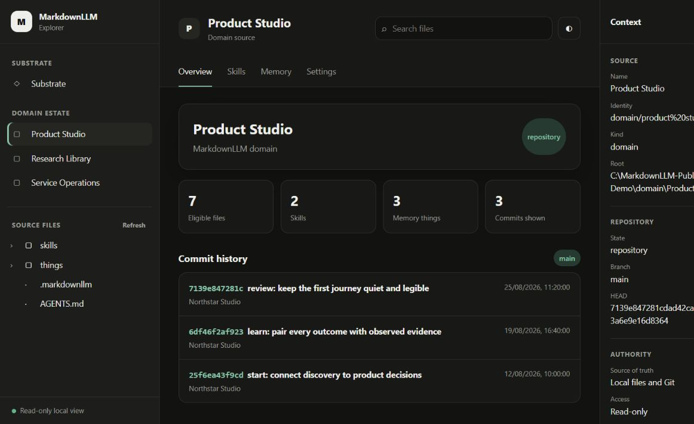
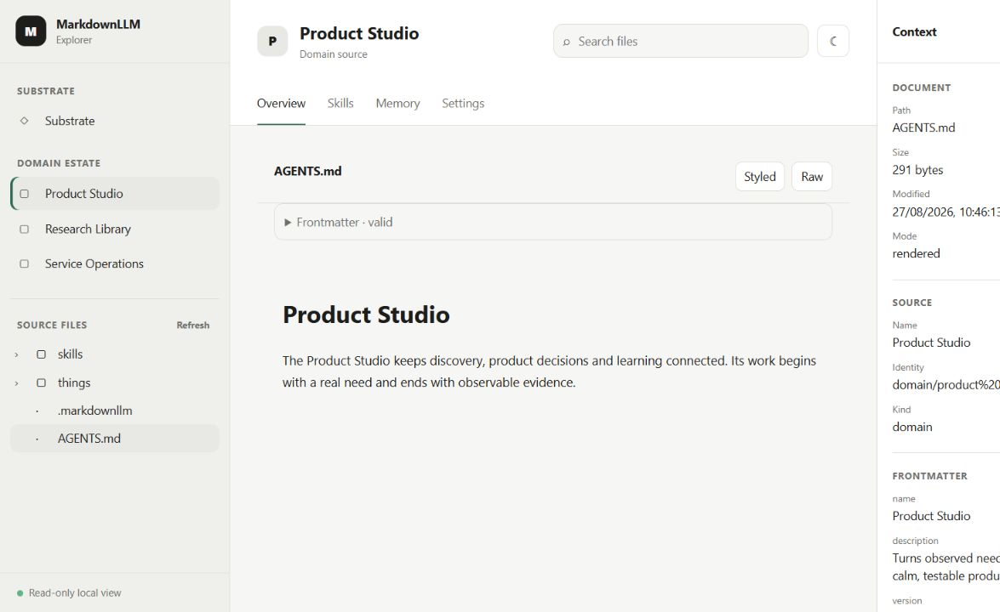
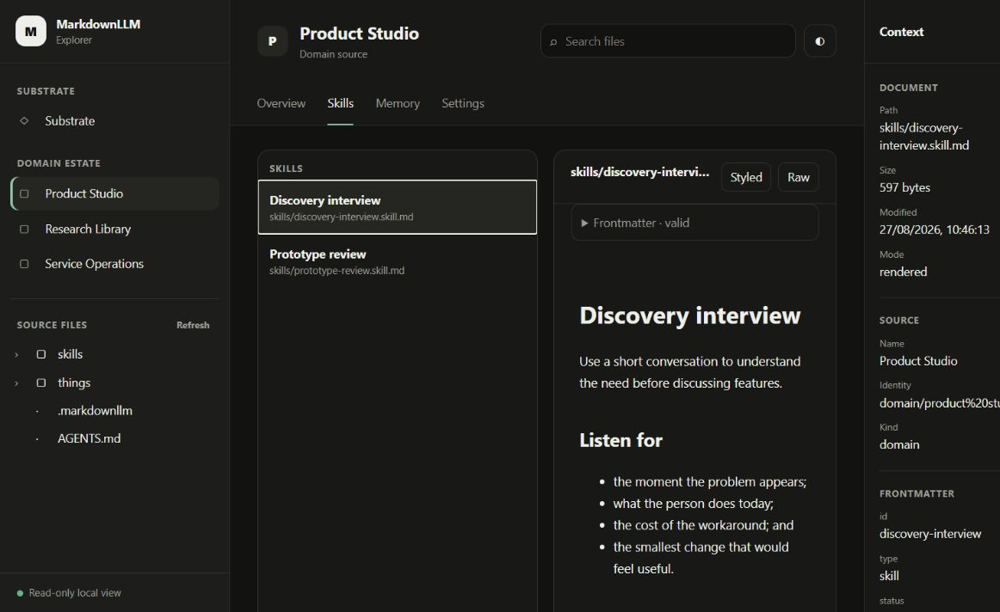
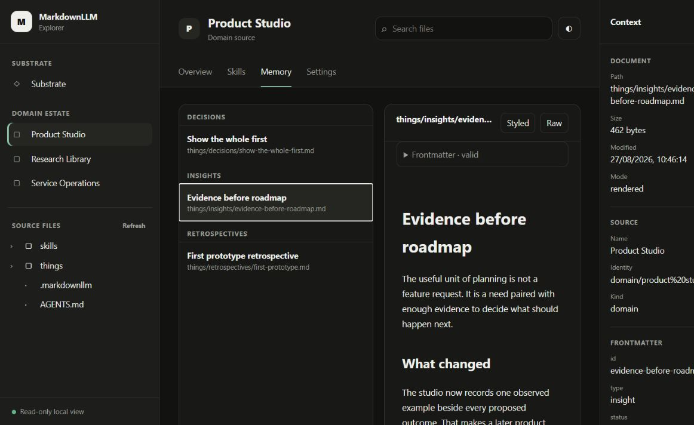
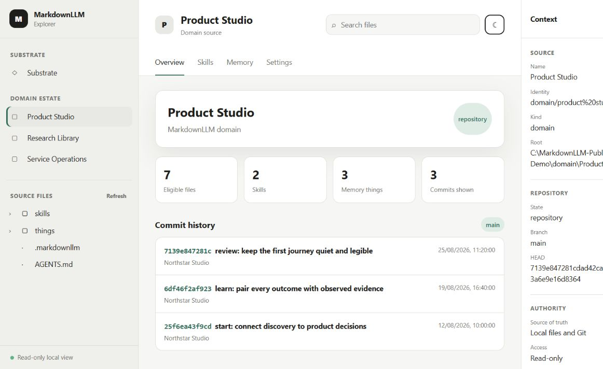

# Explore a MarkdownLLM estate

MarkdownLLM Explorer turns a substrate and its domains into a calm, visual
map. Files and git remain the source of truth; Explorer gives you a way to see
and read them without using the command line.

> Explorer is currently a **Windows preview**. It is for inspection only: it
> does not change files, run an agent, synchronise repositories or publish
> anything.

All images in this guide come from **Northstar Studio**, a completely fictional
estate created for public demonstrations.

## Start with the whole

The left side always shows two levels:

- **Substrate** — the shared MarkdownLLM framework at the top.
- **Domain estate** — the independent domains beneath it.

Choose any name to make it the active source. The centre changes immediately;
the right side confirms what you are looking at and that access is read-only.

## See what changed

**Overview** is the front door to a source. It shows the number of files,
skills and memory things, followed by recent commits from that source's own git
history.

Read the subjects from top to bottom to get a quick sense of movement. Choose a
different domain and the history changes with it.

Choose a commit to see what it actually changed. The paths it touched appear on
the left, each marked as added, changed or deleted, and choosing one shows that
file **as the commit left it** — not as it is today. The lines the commit added
are marked, and the line numbers are named above the file so you can find them
without relying on the colour.

A deleted path has no content at that commit and says so. A path this source
does not show — a secret name, an ignored folder, a file another domain owns —
is listed but cannot be opened, so the history never becomes a way around what
the file view will not show you.

## Read any file

Use **Source files** on the left to open folders and files. Markdown opens as a
styled document by default, with its frontmatter kept separately and clearly
labelled.

Choose **Raw** when you need to see the exact Markdown source. Choose
**Styled** to return to the reading view. Explorer never edits the file.

When a thing names other things in its frontmatter — what informed it, what it
is linked to, what it depends on — those appear in the right panel as buttons
rather than as raw data. Choose one to open the thing it names. A reference
Explorer cannot find in this source is shown as unresolved rather than as a
button that goes nowhere; a reference to a thing that lives in another domain
will read that way, which is accurate.

The search box filters by file path. It is useful when you know part of a file
or folder name but not where it lives.

## Find the reusable skills

Open **Skills** to see the Markdown files in the active source's `skills`
folder. Choose a skill to read it without losing the estate around you. Refresh,
Back and Forward restore both the skill and the surrounding Skills collection.

## Follow the memory

Open **Memory** to see decisions, insights, conflicts and retrospectives. Items
are grouped by kind, so you can move from a decision to the learning that
informed it. Each group can be folded away with the arrow beside its name, and
the count stays visible so a folded group still tells you how much is in it. A
refreshed or restored Memory link keeps the grouped collection visible beside
the selected item.

Memory is not a chat transcript. It is the durable Markdown that helps a domain
carry reasoning across sessions.

## Make it comfortable

Use the small theme button beside search to move between **system**, **light**
and **dark**. Explorer remembers the choice in your browser without changing
the source or document you have open.

On a wide screen the left navigation and the right context panel can each be
folded away with the arrow in their corner, giving the reading area the space
back. Explorer remembers each choice, and the buttons in the header bring the
panel back. On a narrow screen the same buttons open the panels as overlays
instead.

## A useful first journey

If this is your first visit:

1. Choose **Substrate** and read the latest commits.
2. Choose one domain and open its `AGENTS.md`.
3. Read one item under **Skills**.
4. Read one item under **Memory**, and follow one of its references.
5. Return to **Overview** and open a commit to see what it changed.

You will have seen the whole estate, the purpose of one domain, one reusable
capability and one piece of durable learning.

## What Explorer will not do

Explorer cannot edit, create, delete, commit, pull or push. It does not run
skills or talk to an LLM. That boundary is intentional: the interface is a
window onto the accepted local state, not another place where state can change.

For installation or update help, see the
[Windows installation guide](installation-guide.md).
