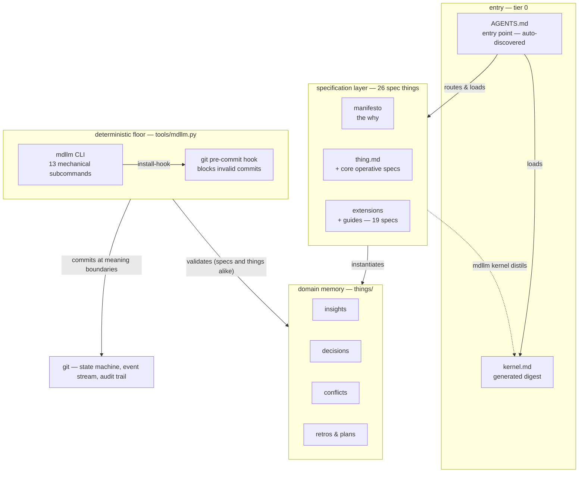
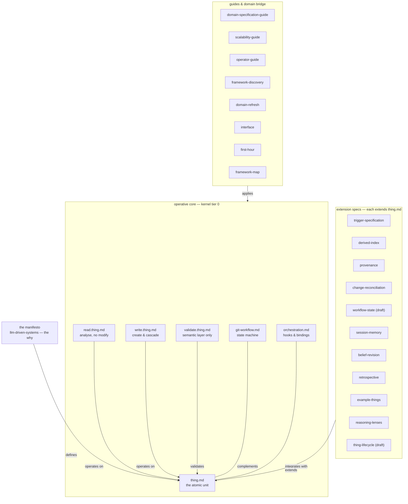
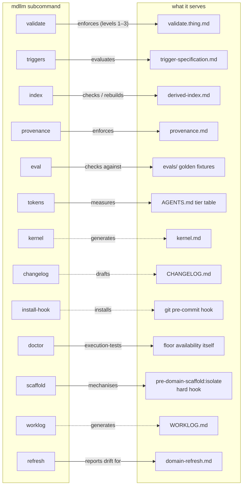

# Framework Map — The Visual Architecture

A scrollable codebase teaches you its shapes; a specification framework hides
them in frontmatter. This map is the substitute for that intimacy: three views,
zooming in, each derived from the repo itself — the spec-to-spec edges from
each file's `linked_things` frontmatter, the subcommand list from
`mdllm --help`, the tier structure from `AGENTS.md`. When you are lost, start
here, not in the prose.

**The compressed mental model: one atom, six operative rules, everything else
is layering.** The manifesto defines [thing.md](thing.md); five operative specs
say what may be done to the atom; those six are distilled into
[kernel.md](kernel.md) so a session starts on ~5.3k tokens (measured
2026-06-11 — re-measure with `mdllm tokens`, never assert); nine extension
specs each bolt one capability onto the atom; the guides only point inward and
never define anything. The mdllm floor is not a tenth concept — it is the same
paper layer made mechanical, one subcommand per spec.

## View 1 — Elevation: the five bands

Read top-down, this is a session's life: `AGENTS.md` routes the query and
loads the kernel (itself generated *from* the spec layer — hence the dashed
return edge), the specs define the types that the things in `things/`
instantiate, `mdllm` validates everything mechanically, and git makes state
real at the commit boundary.

Notes on this view:

- The kernel edge points *up*: `kernel.md` is generated output, regenerated by
  `mdllm kernel` after any spec change. It is the only file in the entry band
  that the floor produces.
- `things/` is the framework's own memory — the framework is a domain within
  itself, so its insights, decisions, conflicts, retrospectives, and plans are
  ordinary things instantiating the reserved types the spec layer defines.
- Domains (`domain/*`) are deliberately absent: they are nested, gitignored,
  independent repos. Each repeats this whole elevation internally with its own
  AGENTS.md, skills, and things.

## View 2 — The spec layer: what defines what

Built from the `linked_things` frontmatter of every root spec. The structure
that falls out: the manifesto defines the atom; read/write/validate operate on
it; git-workflow and orchestration flank it; everything else extends or
applies. The six specs inside the dashed core are exactly the set
`mdllm kernel` distils — which is why tier 0 dropped from 26.5k to 5.3k
tokens.

Notes on this view:

- **The navigation rule:** when lost, start at `thing.md` and follow one
  `extends` edge outward. Every extension spec's first frontmatter relation is
  `extends: thing-specification` (exception: `reasoning-lenses` carries no
  outbound links — read/write reference it rather than it extending the atom,
  but it lives in the same band).
- The guides column never defines semantics — it only points back inward. You
  can ignore it entirely when reasoning about what the framework *is*;
  it matters when scaffolding, scaling, or refreshing a domain.
- `interface.md` sits in the bridge band because it is the I/O boundary
  (deliverables vs things), defined by the manifesto alongside `thing.md` and
  `git-workflow.md`.
- Full edge list lives in the frontmatter of the specs themselves — the map
  shows the load-bearing edges only.

## View 3 — The deterministic floor: subcommand → spec

Each `mdllm` subcommand exists to mechanise exactly one piece of the paper
layer, so the tool is best understood as a mapping, not a monolith. Solid
edges enforce or measure a spec; dashed edges generate an artifact.

Notes on this view:

- The division of labour is the point: the floor owns mechanical validation
  (structural, referential, schema); the agent owns semantic validation only
  (`validate.thing.md` → Layer 2). Never re-perform a mechanical check by
  reasoning.
- `install-hook` is the floor enforcing itself: it wires `validate` into the
  commit boundary so the guarantee survives agents that forget to run it.
- `doctor` is the floor checking it can exist here at all: prerequisites,
  hook *execution* (resolution is not verification), and framework-version
  drift for domains. Exit 1 means degraded mode — validate manually and say so.

## Keeping This Map Honest

This map is hand-drawn, and
[tracking artifacts can drift from reality](things/insights/tracking-artifacts-can-drift-from-reality.md).
Its sources of truth are mechanical — check against them, do not trust the map
over them:

- **View 1:** the root file listing and `AGENTS.md` tier structure.
- **View 2:** each spec's `linked_things` frontmatter; the kernel coverage
  count in `kernel.md` frontmatter (`coverage: 6`).
- **View 3:** `python tools/mdllm.py --help`.

When a spec is added, removed, or rewired — or a subcommand lands — update the
affected view in the same commit. If the map and the frontmatter disagree, the
frontmatter wins and the map has a bug.
