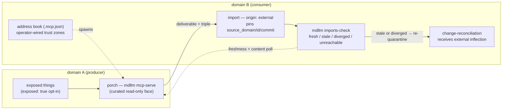

# Cross-Domain Sync Catch-up

The cross-domain mechanism (porch, address book, reference triple,
`imports-check`) landed in v3.15–3.16 and works. An estate audit of four
sealed domains (2026-07-27, brief at baseline v3.19.0) found that the
**paper lags the mechanism** at four points — and the operator is now
*feeling* the fifth gap live: domains drifting out of sync with no
floor-driven procedure to see it. This plan is the catch-up release: one
trigger-evaluator fix, one reporting-honesty fix, the sync procedure the
desync demands, and the spec/docs graduation the mechanism has been owed
since it shipped.

Deploy-now, not deploy-when-felt: the desync is being felt. It is the
reason this plan exists.

## The loop, and where it lags

Blue path = built and landed. The lags: the triple and `exposed` are
tool-read but spec-unwritten (thing.md, provenance.md); the
change-reconciliation edge is undeclared in the spec that receives it; the
operator docs are silent on running more than one domain; the
`imports-check` summary line reports `0 stale` even when zero comparisons
were possible; and until this plan, the `diverged` state did not exist at
all.

**Diagram export pointer (operator ask, 2026-07-27):** Phase 7 landed this
as `docs/framework-map.md` View 4 — the estate seam. **The map copy is now
canonical**; the copy above is the plan-time record and is not maintained.
Export beyond the map (README, operator-guide) only when a real second
operator needs onboarding — the map is the framework's one home for views,
and duplicating views is the map-drift class v3.17.1 exists to catch.

## Design decisions

- **Sync stays consumer-side; the estate view is batching, not an index.**
  The felt failure — "source behind mirror", i.e. an imported copy edited
  while the pins still agree — is detectable *through the porch*: when the
  pinned commit equals the source's current commit but the mirror's body no
  longer matches the face's content, the loop was bypassed. That makes the
  new `diverged` state a per-consumer read obeying the same membrane as
  everything else. `mdllm estate-check <root> <root> ...` is then only a
  loop over `imports-check`: roots are named explicitly per invocation
  (no discovery, no config, no persisted output), the report is grouped
  per-consumer (never a per-source reverse map — a domain still cannot
  enumerate its consumers), and every read is exactly the read that
  consumer could make alone. Loose, tidy, cohesive — never a global index.
- **Reporting states coverage, never assurance.** The summary line counts
  stale / diverged / fresh / not-checkable separately and shows coverage
  explicitly; exit code stays 0 because the tool is report-only by doctrine
  ("disposition is yours") — the fix is making the line un-misreadable,
  not making it a gate.
- **The cue stays human.** A stale or diverged import is a mechanical
  *signal*; routing it as an inflection into change-reconciliation remains
  the driver's declaration, exactly as the spec's "The Driver Names The
  Inflection" already requires. The floor makes the drift impossible to
  not see; it never dispositions.
- **Specs are written where authors look.** The triple and `exposed` move
  from the draft design doc into thing.md and provenance.md (the design doc
  stays as design record); the kernel — stale at 3.17.5 — regenerates with
  them.
- **FW-1 rides along.** The trigger evaluator's silently-dropped free-text
  `time` conditions are the same defect class (a control under-reporting
  without saying so) and the patch arrived pre-verified with the audit
  brief; it lands first, per the brief's own ordering.
- FW-0 (the disclosure leak) needs nothing here: the 2026-07-27 history
  rewrite plus v3.20.0's boundary-disclosure-check already closed it.

## Phases

| Phase | Scope | Status |
|---|---|---|
| 1 | Plan (this thing) | done |
| 2 | FW-1: triggers — free-text time conditions evaluated or loudly skipped; `date` alias; overdue-with-trigger unsuppressed; self-tests | done |
| 3 | FW-2: imports-check coverage-honest summary; self-test | done |
| 4 | Sync: `diverged` detection through the face; `estate-check` multi-root batching; framework-map count; self-tests | done |
| 5 | FW-3: triple + `exposed` into thing.md + provenance.md; kernel regen | done |
| 6 | FW-4: change-reconciliation external-inflection edge + scope statement | done |
| 7 | FW-5(1): operator-guide toolbox + "running more than one domain"; framework-map estate view (diagram graduates) | done |
| 8 | Close: CHANGELOG, version, sentinel trio, full validate/coherence/tests, outcome here | done |

## Outcome

Shipped as v3.21.0, all eight phases, one session (2026-07-27/28). The felt
desync direction — source behind mirror — is now mechanically visible:
`imports-check` compares content through the face when pins agree and reports
`DIVERGED`; `estate-check` batches the read over named roots with a roll-up
and stays batching-never-an-index by construction. Reporting states coverage
(`COVERAGE: n/m`, zero-coverage said in words). The trigger evaluator
evaluates or loudly skips free-text time conditions, honours `type: date`,
and no longer hides OVERDUE behind a declared trigger. The triple + `exposed`
are normative in thing.md/provenance.md; change-reconciliation owns its
inbound external-inflection edge; the operator docs and framework-map know
estates exist (View 4 — the diagram's canonical home, per the export pointer
above). Kernel regenerated; examples re-pinned at 3.21.0. 8 self-tests
(143 total). FW-0 needed nothing (closed by the 2026-07-27 history rewrite +
v3.20.0 boundary check); FW-5(2)'s original "hold for evidence" was
overridden by the operator on felt evidence — the evidence had arrived.
